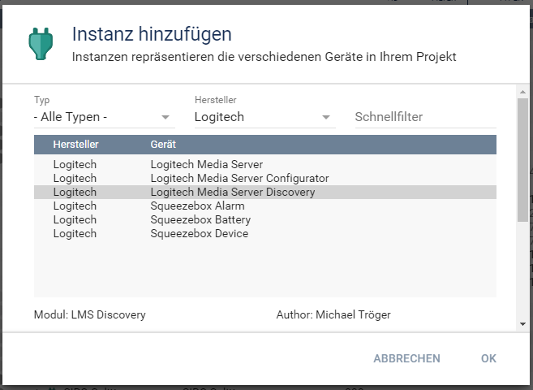
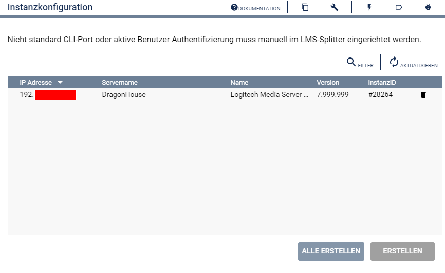

  

   
 
# Logitech Media Server Discovery  <!-- omit in toc -->
Sucht Logitech Media Server im Netzwerk  

## Dokumentation  <!-- omit in toc -->

**Inhaltsverzeichnis**

- [1. Funktionsumfang](#1-funktionsumfang)
- [2. Voraussetzungen](#2-voraussetzungen)
- [3. Software-Installation](#3-software-installation)
- [4. Verwendung](#4-verwendung)
- [5. Statusvariablen und Profile](#5-statusvariablen-und-profile)
- [6. WebFront](#6-webfront)
- [7. PHP-Befehlsreferenz](#7-php-befehlsreferenz)
- [8. Aktionen](#8-aktionen)
- [9. Anhang](#9-anhang)
  - [1. Changelog](#1-changelog)
  - [2. Spenden](#2-spenden)
- [10. Lizenz](#10-lizenz)

## 1. Funktionsumfang

 - Einfaches Auffinden von Logitech Media Servern im lokalen Netzwerk.  
 - Einfaches Einrichten von Konfiguratoren für gefundene Server.  

## 2. Voraussetzungen

 - IP-Symcon ab Version 7.1
 - Logitech Media Server (getestet ab 7.9.x)

## 3. Software-Installation

 Dieses Modul ist Bestandteil der [SqueezeBox-Library](../README.md#3-software-installation).  

## 4. Verwendung

**Hinweis**  
~~~~
Über einen Netzwerk Broadcast wird versucht alle im Netzwerk vorhandenen `Logitech Media Server` aufzufinden.  

Werden Symcon und der `Logitech Media Server` allerdings in verschiedenen (gerouteten) Netzwerkren betrieben, oder z.B. Symcon hinter einer NAT, so wird in der Regel kein `Logitech Media Server` gefunden.  

Der [Squeezebox Konfigurator](LMSConfigurator/) muss in dieser Konstellation per Hand angelegt und sein dazugehöriger [LMS Splitter](LMSSplitter/) manuell konfiguriert werden.  
~~~~  

Nach der installation des Moduls, erfolgt eine Aufforderung von der Konsole diese `Discovery Instanz` zu erstellen.  
Bei der manuellen Einrichtung ist die Instanz im Dialog `Instanz hinzufügen` unter dem Hersteller `Logitech` zu finden.  
  
Die Instanz `Logitech Media Server Discovery` wird im Objektbaum unter `Discovery Instanzen` einsortiert.  
Beim dem Öffnen der Instanz, werden alle im Netzwerk gefundenen `Logitech Media Server` aufgelistet.  
  

Über das selektieren eines Servers in der Tabelle und betätigen des dazugehörigen `Erstellen` Button, wird ein entsprechender [Logitech Media Server Konfigurator](../LMSConfigurator/README.md) inklusive `LMS Splitter` und `Client Socket` in IPS angelegt.  
Mit dieser `Konfigurator Instanz` können dann die einzelnen `Geräte Instanzen` in IPS erzeugt werden.   

## 5. Statusvariablen und Profile

Die Discovery Instanz besitzt keine Statusvariablen und Variablenprofile.  

## 6. WebFront

Die Discovery Instanz besitzt keine im WebFront darstellbaren Elemente.  

## 7. PHP-Befehlsreferenz

Die Discovery Instanz besitzt keine Instanz-Funktionen.  

## 8. Aktionen

Die Discovery Instanz unterstützt keine Aktionen.  

## 9. Anhang

### 1. Changelog

[Changelog der Library](../README.md#3-changelog)

### 2. Spenden

Die Library ist für die nicht kommerzielle Nutzung kostenlos, Schenkungen als Unterstützung für den Autor werden hier akzeptiert:  

  PayPal:  
  

  Wunschliste:  
  

## 10. Lizenz

  IPS-Modul:  
  [CC BY-NC-SA 4.0](https://creativecommons.org/licenses/by-nc-sa/4.0/)  
