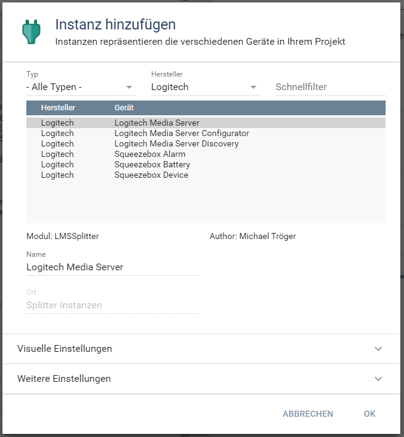
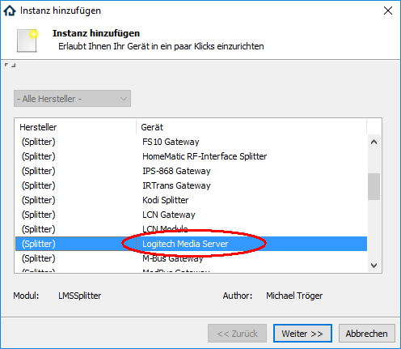
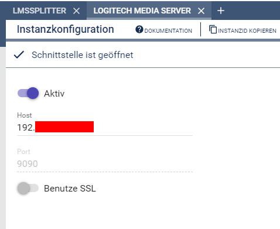
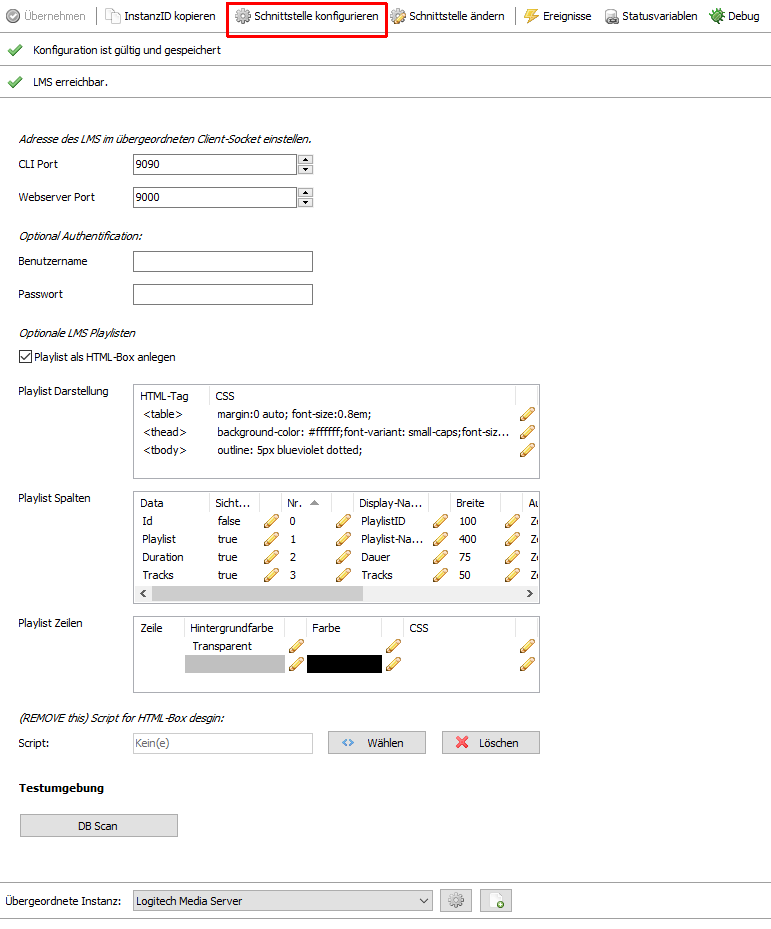
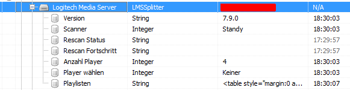
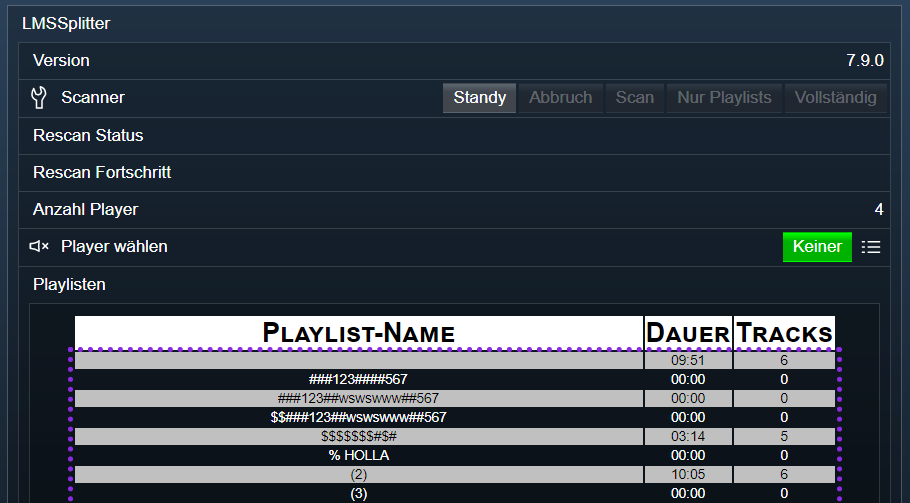

# Logitech Media Server Splitter (LMSSplitter)
Ermöglich die Kommunikation von IPS mit dem CLI des Logitech Media Servers.  

## Dokumentation

**Inhaltsverzeichnis**

1. [Funktionsumfang](#1-funktionsumfang)  
2. [Voraussetzungen](#2-voraussetzungen)  
3. [Software-Installation](#3-software-installation) 
4. [Einrichten der Instanzen in IP-Symcon](#4-einrichten-der-instanzen-in-ip-symcon)
5. [Statusvariablen und Profile](#5-statusvariablen-und-profile)
6. [WebFront](#6-webfront)
7. [PHP-Befehlsreferenz](#7-php-befehlsreferenz) 
8. [Anhang](#8-anhang)  
9. [Lizenz](#9-lizenz)

## 1. Funktionsumfang

 - Auslesen un darstellen von Server-Informationen.  
 - Auslesen von Datenbank Informationen.  
 - Auslesen und bearbeiten von Server-Playlisten.  
 - Laden von Server-Playlisten über das WebFront in einen (mehrere) Player.  
 - Steuern des Scanner der Datenbank inkl. Darstellung des laufenden Modi vom Scanner.  

## 2. Voraussetzungen

 - IPS 4.3 oder höher
 - Logitech Media Server (getestet ab 7.9.x)
 - kompatibler Player

## 3. Software-Installation

 Dieses Modul ist Bestandteil der IPSSqueezeBox-Library.  
   *Über das 'Modul Control' folgende URL hinzufügen:  
    `git://github.com/Nall-chan/IPSSqueezeBox.git`  

## 4. Einrichten der Instanzen in IP-Symcon

Der Splitter wird automatisch erzeugt, sobald z.B. der Konfigurator [Logitech Media Server Konfigurator](../../LMSConfigurator/readme.md) angelegt wird.  
Bei der manuellen Einrichtung ist die Instanz im Dialog 'Instanz hinzufügen' unter dem Hersteller 'Logitech' zufinden.  
  

Alternativ ist es auch in der Liste alle Splitter aufgeführt.  
  

Es wird automatisch eine 'Client Socket' Instanz erzeugt.  
Dieser muss über die Schaltfläche 'Gateway konfigurieren' noch geöffnet und konfiguriert werden.  
In dem Client Socket ist die IP-Adresse bzw. der Hostname einzutragen unter dem der 'Logitech Media Server' erreichbar ist.  
  

**Konfigurationsseite:**  
  

| Name                          | Eigenschaft  | Typ     | Standardwert | Funktion                                                  |
| :---------------------------: | :----------: | :-----: | :----------: | :-------------------------------------------------------: |
| CLI Port                      | Port         | integer | 9090         | CLI-Port des LMS                                          |
| Webserver Port                | Webport      | integer | 9000         | Port des LMS-Webserver                                    |
| Benutzername                  | User         | string  |              | Benutzername wenn im LMS die Authentifizierung aktiv ist. |
| Passwort                      | Password     | string  |              | Passwort wenn im LMS die Authentifizierung aktiv ist.     |
| Playlist als HTML-Box anlegen | showPlaylist | boolean | true         | de/aktiviert die Anzeige der Playlist als HTML-Box.       |
| Playlist Darstellung          | Table        | string  | Tabelle      | Style Eigenschaften der Playlist HTML-Tabelle.            |
| Playlist Spalten              | Columns      | string  | Tabelle      | Style Eigenschaften der Playlist Spalten.                 |
| Playlist Zeilen               | Rows         | string  | Tabelle      | Style Eigenschaften der Playlist Zeilen.                  |


## 5. Statusvariablen und Profile

Folgende Statusvariablen werden automatisch angelegt.
**Statusvariablen allgemein:**  

| Name                        | Typ     | Ident          | Beschreibung                                                   |
| :-------------------------: | :-----: | :------------: | :------------------------------------------------------------: |
| Version                     | string  | Version        | Software-Version des Logitech Media Server.                    |
| Scanner                     | integer | RescanState    | Aktueller Zustand vom Datenbank Scanner.                       |
| Rescan Status               | string  | RescanInfo     | Aktueller Status bei aktivem scan.                             |
| Rescan Fortschritt          | string  | RescanProgress | Aktueller Fortschritt bei aktivem scan.                        |
| Anzahl Player               | integer | Players        | Anzahl der des Server bekannten Player.                        |
| Player wählen               | integer | PlayerSelect   | Spezialvariable für das Laden von Playlisten aus dem WebFront. |
| Playlisten                  | string  | Playlists      | HTML-Box mit allen dem Server bekannten Playlisten.            |
  

**Profile**:

| Name               | Typ     | verwendet von Statusvariablen |
| :----------------: | :-----: | :---------------------------: |
| LMS.Scanner        | integer | Scanner                       |
| LMS.PlayerSelect.* | integer | PlayerSelect                  |


## 6. WebFront

Die direkte Darstellung im WebFront ist nicht möglich, es ist zwingend ein Link auf die Instanz bzw die Statusvariablen anzulegen.  
Beispiel mit einem Links auf die Instanz:  
  

## 7. PHP-Befehlsreferenz

Für alle Befehle gilt: Tritt ein Fehler auf, wird eine Warnung erzeugt.
Dies gilt auch wenn ein übergebender Wert für einen Parameter nicht gültig ist, oder außerhalb seines zulässigen Bereiches liegt.  

#### 1. Server:

```php
bool LMS_KeepAlive(int $InstanzID)`  
```
Sendet einen listen Abfrage an den LMS um die Kommunikation zu erhalten.  
Liefert `true` bei Erfolg, sonst `false`.  

```php
array LMS_SendSpecial(int $InstanzID,string $Command, string $Value)
```
Sendet ein CLI Kommando an den LMS.  
Hierzu ist in $Command das Kommando z.B. 'version' zu übergeben.  
In $Value wird ein als JSON-String codiertes Array erwartet, welche die Daten des Kommandos enthalten muss.  
z.B. '["?"]'   
Liefert die Antwort als Array.  
Im Fehlerfall wird `false` zurückgegeben.  

```php
bool LMS_RestartServer(int $InstanzID)`  
```
Sendet einen Reset Befehl an den LMS.  
Liefert `true` bei Erfolg, sonst `false`.  

```php
bool LMS_RequestState(int $InstanzID, string $Ident)`  
```
Fragt einen einzelnen Wert ab.  
Es ist der Ident der Statusvariable zu übergeben.  
Unterstützt wird 'Players', 'Version' und 'Playlists'.  
Liefert `true` bei Erfolg, sonst `false`.  

```php
array LMS_GetAudioDirs(int $InstanzID)`  
```
Liefert ein Array mit allen Audio-Verzeichnissen des Server.  
Im Fehlerfall wird `false` zurückgegeben.  

```php
string LMS_GetPlaylistDir(int $InstanzID)`  
```
Liefert das Verzeichnis mit den Server-Playlisten.  
Im Fehlerfall wird `false` zurückgegeben.  

```php
array LMS_GetPlayerInfo(int $InstanzID, int $Index)
```
Liefert ein assoziertes Array mit den Daten des Players.  
Im Fehlerfall wird `false` zurückgegeben.  

**Array:**  

| Index       | Typ     | Beschreibung                    |
| :---------: | :-----: | :-----------------------------: |
| Playerindex | integer | Index des Players im Server     |
| Playerid    | string  | IP oder MAC-Adresse des Players |
| Uuid        | string  | interne ID des Players          |
| Ip          | string  | IP-Adresse des Players          |
| Name        | string  | Name des Players                |
| Model       | string  | Typ vom Player                  |
| Modelname   | string  | Modelname vom Player            |
| Displaytype | string  | Typ des Display                 |
| Connected   | bool    | Verbunden mit dem Server        |
| Instanceid  | integer | InstanzeID wenn in IPS angelegt |
  
#### 2. Datenbank-Scanner:

```php
bool LMS_Rescan(int $InstanzID)
```
Startet einen rescan der Datenbank.  
Liefert `true` bei Erfolg, sonst `false`.  

```php
bool LMS_RescanPlaylists(int $InstanzID)
```
Startet einen rescan der Datenbank für die Playlists.  
Liefert `true` bei Erfolg, sonst `false`.  

```php
bool LMS_WipeCache(int $InstanzID)
```
Löscht den Cache der DB.  
Liefert `true` bei Erfolg, sonst `false`.  

```php
bool LMS_AbortScan(int $InstanzID)
```
Bricht einen Scan der Datenbank ab.  
Liefert `true` bei Erfolg, sonst `false`.  


#### 3. Datenbank:

```php
array LMS_GetLibaryInfo (int $InstanzID)  
```
Liefert Informationen über die Datenbank des LMS.  

**Array:**  

| Index   | Typ     | Beschreibung                |
| :-----: | :-----: | :-------------------------: |
| Genres  | integer | Anzahl verschiedener Genres |
| Artists | integer | Anzahl der Interpreten      |
| Albums  | integer | Anzahl der Alben            |
| Songs   | integer | Anzahl aller Titel          |

```php
array LMS_GetGenres (int $InstanzID)  
array LMS_GetGenresEx (int $InstanzID, string $Search)  
```
Liefert Informationen über die Genres des LMS.  
'$Search' kann benutzt werden um nur nach bestimmten Zeichenketten in den Genres zu suchen.  
Es wird ein Array zurückgeben mit allen Genres, wobei der Index die GenreID des Servers darstellt.  
Im Fehlerfall wird `false` zurückgegeben.  
**Beispiel:**  
  [96]  => "Alternative Musik"  
  [95]  => "Hörspiel"  
  [71]  => "JPop"  
  
```php
array LMS_GetAlbums (int $InstanzID)  
array LMS_GetAlbumsEx (int $InstanzID, string $Search)  
```
Liefert Informationen über die Alben des LMS.  
'$Search' kann benutzt werden um nur nach bestimmten Zeichenketten in den Alben zu suchen.  
Es wird ein Array zurückgeben mit allen Alben, wobei der Index die AlbumID des Servers darstellt.  
Im Fehlerfall wird `false` zurückgegeben.  
**Beispiel:**  
  [1359] => "Bubblegum Crisis: Complete Vocal Collection, Volume 1"  
  [1361] => "Bubblegum Crisis Tokyo 2040"  
  [2373] => "Buffy the Vampire Slayer: The Album"  
  [1791] => "Can't Stop Raving"  
  [1365] => "Captain Future"  
  
```php
array LMS_GetArtists (int $InstanzID)  
array LMS_GetArtistsEx (int $InstanzID, string $Search)  
```
Liefert Informationen über die Interpreten.  
'$Search' kann benutzt werden um nur nach bestimmten Zeichenketten in den Namen zu suchen.  
Es wird ein Array zurückgeben mit allen bekannten Interpreten, wobei der Index die ArtistID des Servers darstellt.  
Im Fehlerfall wird `false` zurückgegeben.  
**Beispiel:**  
  [4235] => "Bert Berns"  
  [4236] => "Bert Russell"  
  [3736] => "The Beu Sisters"  
  

#### 4. Dateien:

```php
array LMS_GetDirectoryByID (int $InstanzID, int $FolderID)  
array LMS_GetDirectoryByIDRecursiv (int $InstanzID, int $FolderID)
array LMS_GetDirectoryByURL (int $InstanzID, string $Directory)  
array LMS_GetDirectoryByURLRecursiv (int $InstanzID, string $Directory)
```
Liefert Informationen über ein Verzeichnis des LMS.  
Es wird ein mehrdimensionales Array zurückgeben mit allen Medien, wobei der erste Index die DateiID der Mediadatei darstellt.  
Im Fehlerfall wird `false` zurückgegeben.  

**Array:**  

| Index    | Typ     | Beschreibung                               |
| :------: | :-----: | :----------------------------------------: |
| Filename | string  | Datei-/Ordnername                          |
| Type     | string  | track oder folder                          |
| Coverid  | integer | CoverID der Datei. 0 wenn nicht vorhanden  |
| Url      | string  | Kompletter Dateiname                       |

**Beispiel:**  
  [28525]=>
  array(4) {
    ["Filename"] => "01-03- 80 Millionen.mp3"
    ["Type"]     => "track"
    ["Coverid"]  => 8
    ["Url"]      => "file:///......../Der Junge, der rennt/01-03- 80 Millionen.mp3"
  }

```php
array LMS_GetSongInfoByFileID (int $InstanzID, int $SongID)
array LMS_GetSongInfoByFileURL (int $InstanzID, string $SongURL)
```
Liefert Details zu einem Song anhand der '$SongID' oder '$SongURL'.  
Es wird ein assoziertes Array zurückgeben.  
Im Fehlerfall wird `false` zurückgegeben.  

**Array:**  

| Index            | Typ     | Beschreibung                        |
| :--------------: | :-----: | :---------------------------------: |
| Id               | integer | ID des Song in der LMS-Datenbank    |
| Title            | string  | Titel                               |
| Genre            | string  | Genre                               |
| Album            | string  | Album                               |
| Artist           | string  | Interpret                           |
| Duration         | integer | Länge in Sekunden                   |
| Disc             | integer | Aktuelles Medium                    |
| Disccount        | integer | Anzahl aller Medien dieses Albums   |
| Bitrate          | string  | Bitrate in Klartext                 |
| Tracknum         | integer | Tracknummer im Album                |
| Url              | string  | Pfad der Playlist                   |
| Album_id         | integer | UID des Album in der LMS-Datenbank  |
| Artwork_track_id | string  | UID des Cover in der LMS-Datenbank  |
| Genre_id         | integer | UID des Genre in der LMS-Datenbank  |
| Artist_id        | integer | UID des Artist in der LMS-Datenbank |
| Year             | integer | Jahr des Song, soweit hinterlegt    |


```php
array LMS_GetSongsByAlbum(int $InstanzID, int $AlbumId)
array LMS_GetSongsByAlbumEx(int $InstanzID, int $AlbumId, string $Search)
array LMS_GetSongsByArtist(int $InstanzID, int $ArtistId)
array LMS_GetSongsByArtistEx(int $InstanzID, int $ArtistId, string $Search)
array LMS_GetSongsByGenre(int $InstanzID, int $GenreId)
array LMS_GetSongsByGenreEx(int $InstanzID, int $GenreId, string $Search)
```
Liefert Details über Songs, welche den angegeben Suchkriterien entsprechen.  
Dazu ist jeweils '$AlbumId', '$ArtistId' oder die '$GenreId' zu übergeben.  
Der Parameter '$Search' liefert nur Ergebnisse wo dieser Such-String enthalten ist.  
Es wird ein mehrdimensionales Array zurückgeben mit allen gefundenen Songs.  
Im Fehlerfall wird `false` zurückgegeben.  
Die enthaltenen assozierten Array entsprechen dem von LMS_GetSongInfoBy*.  

```php
array LMS_Search(int $InstanzID, string $Value)
```
//TODO

#### 5. Playlisten:

```php
array LMS_GetPlaylists (int $InstanzID)
array LMS_GetPlaylistsEx (int $InstanzID, string $Search)
```
Liefert Informationen über alle Playlisten bzw. über Playlisten welche den Such-String aus $Search enthalten.  
Es wird ein mehrdimensionales Array zurückgeben mit , wobei der erste Index die PlaylistID der Playlist darstellt.  
Im Fehlerfall wird `false` zurückgegeben.  

**Array:**  

| Index    | Typ     | Beschreibung                       |
| :------: | :-----: | :--------------------------------: |
| Playlist | string  | Name der Playlist                  |
| Url      | string  | Kompletter Dateiname               |
| Id       | string  | PlaylistID der Playlist            |
| Tracks   | integer | Anzahl der Tracks in der Playlist  |
| Duration | integer | Laufzeit der Playlist in Sekunden  |


**Beispiel:**  
  [35090]=>
  array(5) {
    ["Playlist"] => "AKB"
    ["Url"]      => "file:///E:/ServerFolders/Musik/Playlist/AKB.m3u"
    ["Id"]       => 35090
    ["Tracks"]   => 64
    ["Duration"] => 223
  }

```php
int LMS_CreatePlaylist (int $InstanzID, string $Name)
```
Erzeugt eine neue Playlist.  
Es wird die PlaylistID der Playlist zurückgegeben, oder `false` im Fehlerfall.  

```php
bool LMS_RenamePlaylist (int $InstanzID, int $PlaylistId, string $Name)
bool LMS_RenamePlaylistEx (int $InstanzID, int $PlaylistId, string $Name, bool $Overwrite)
```
Ändert den Namen der in '$PlaylistId' übergebenen Playlist in '$Name'.  
Soll eine vorhandene Playlist überschrieben werden, so ist '$Overwrite' auf `true`zu setzen.  
Liefert `true` bei Erfolg, sonst `false`.  

```php
bool LMS_DeletePlaylist (int $InstanzID, int $PlaylistId)
```
Löscht die in '$PlaylistId' übergebene Playlist.  
Liefert `true` bei Erfolg, sonst `false`.  

```php
bool LMS_AddSongToPlaylist (int $InstanzID, int $PlaylistId, string $SongURL)
bool LMS_AddSongToPlaylistEx (int $InstanzID, int $PlaylistId, string $SongURL, int $Position)
```
Fügt der Playlist '$PlaylistId' einen in '$SongURL' übergeben Song hinzu.  
Der Song wird am Ende hinzugefügt, außer es wurde ein anderer Index in '$Position' übergeben.  
Liefert `true` bei Erfolg, sonst `false`.  

```php
bool LMS_MoveSongInPlaylist (int $InstanzID, int $PlaylistId, int $Position, int $NewPosition)
```
Verschiebt die Position eines Song innerhalb einer Playlist.  
Es ist die PlaylistID in '$PlaylistId', der alte Index in '$Position' und der Ziel-Index in '$NewPosition' zu übergeben.  
Liefert `true` bei Erfolg, sonst `false`.  

```php
bool LMS_DeleteSongFromPlaylist (int $InstanzID, int $PlaylistId, int $Position)
```
Entfernt einen Song aus einer Playlist.  
Es ist die PlaylistID in '$PlaylistId', und der zu entfernende Index in '$Position' zu übergeben.  
Liefert `true` bei Erfolg, sonst `false`.  

#### 6. Alarm Playlisten:

```php
array LMS_GetAlarmPlaylists (int $InstanzID)
```
Liefert Informationen über alle Playlisten welche für die Wecker benutzt werden können.  
Es wird ein mehrdimensionales Array mit allen Playlisten zurückgeben.  
Im Fehlerfall wird `false` zurückgegeben.  

**Array:**  

| Index    | Typ     | Beschreibung               |
| :------: | :-----: | :------------------------: |
| Category | string  | Kategorie der Playlist     |
| Title    | string  | Name der Playlist          |
| Url      | string  | komplette URL der Playlist |

#### 7. Favoriten:

```php
array LMS_GetFavorites (int $InstanzID, string $FavoriteID)
```
Liefert Informationen über die unterhalb der '$FavoriteID' übergeben Favoriten.  
Zum auslesen der obersten Ebene der Favoriten ist ein leerer String zu übergeben.  
Es wird ein mehrdimensionales Array mit allen Favoriten der unter '$FavoritenID' vorhandenen Ebene zurückgeben.  
Dabei ist der erste Index die '$FavoriteID' des jeweiligen Favoriten.  
Im Fehlerfall wird `false` zurückgegeben.  

**Array:**  

| Index    | Typ     | Beschreibung                                                  |
| :------: | :-----: | :-----------------------------------------------------------: |
| Name     | string  | Name des Eintrags                                             |
| Type     | string  | Typ des Eintrags                                              |
| Url      | string  | komplette URL                                                 |
| Isaudio  | bool    | true wenn es ein Audiofile ist                                |
| Hasitems | bool    | true wenn unterhalb des Eintrages noch Element vorhanden sind |

**Beispiel:**  
```php
print_r(LMS_GetFavorites($id,'6.1'));
```
`
Array
(
    [6.1] => Array
        (
            [Name] => Wenn sie
            [Isaudio] => 1
            [Icon] => music/28526/cover.png
            [Url] => file:///........./01-05- Wenn sie tanzt.mp3
            [Type] => audio
        )

)
`

```php
bool LMS_AddFavorite (int $InstanzID, string $ParentFavoriteID, string $Title, string $URL)
```
Fügt dem Favoriten '$ParentFavoriteID' einen in '$URL' übergeben Eintrag mit dem Namen aus '$Name' hinzu.  
Liefert `true` bei Erfolg, sonst `false`.  

```php
bool LMS_AddFavoriteLevel (int $InstanzID, string $ParentFavoriteID, string $Title)
```
Fügt dem Favoriten '$ParentFavoriteID' einen neuen Unterordner mit dem Namen aus '$Name' hinzu.  
Liefert `true` bei Erfolg, sonst `false`.  

```php
bool LMS_RenameFavorite (int $InstanzID, string $ParentFavoriteID, string $Title)
```
Fügt dem Favoriten '$ParentFavoriteID' einen neuen Unterordner mit dem Namen aus '$Name' hinzu.  
Liefert `true` bei Erfolg, sonst `false`.  

```php
bool LMS_MoveFavorite (int $InstanzID, string $ParentFavoriteID, string $Title)
```
Fügt dem Favoriten '$ParentFavoriteID' einen neuen Unterordner mit dem Namen aus '$Name' hinzu.  
Liefert `true` bei Erfolg, sonst `false`.  

```php
bool LMS_DeleteFavorite (int $InstanzID, string $ParentFavoriteID, string $Title)
```
Fügt dem Favoriten '$ParentFavoriteID' einen neuen Unterordner mit dem Namen aus '$Name' hinzu.  
Liefert `true` bei Erfolg, sonst `false`.  

#### 8. Radio & Apps:


## 8. Anhang

**Changlog:**  

Version 1.0:  
 - Erstes offizielles Release

## 9. Lizenz

  IPS-Modul:  
  [CC BY-NC-SA 4.0](https://creativecommons.org/licenses/by-nc-sa/4.0/)  