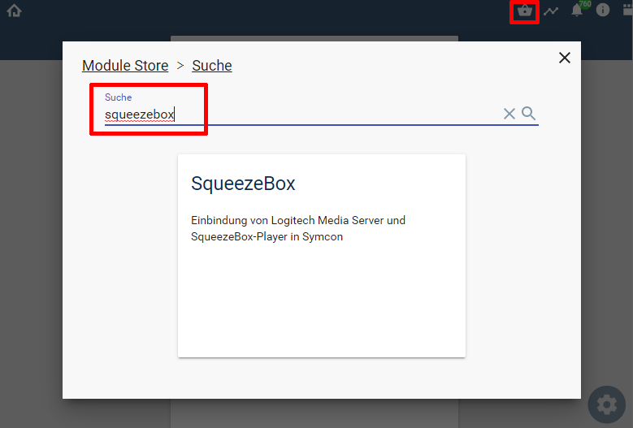

  

   
  

# Symcon-Modul: SqueezeBox  <!-- omit in toc -->  
Ermöglicht die Steuerung sowie die Darstellung der Zustände
von SqueezeBox Geräten in IPS, in Verbindung mit dem
Logitech Media Server.

## Dokumentation <!-- omit in toc -->

**Inhaltsverzeichnis**

- [1. Funktionsumfang](#1-funktionsumfang)
  - [Discovery:](#discovery)
  - [Squeezebox Konfigurator:](#squeezebox-konfigurator)
  - [Logitech Media Server:](#logitech-media-server)
  - [SqueezeBox Player:](#squeezebox-player)
  - [Squeezebox Alarm (Wecker):](#squeezebox-alarm-wecker)
  - [Squeezebox Battery:](#squeezebox-battery)
- [2. Voraussetzungen](#2-voraussetzungen)
- [3. Software-Installation](#3-software-installation)
- [4. Einrichten der Instanzen in IP-Symcon](#4-einrichten-der-instanzen-in-ip-symcon)
- [5. Anhang](#5-anhang)
  - [1. GUID der Module](#1-guid-der-module)
  - [2. Datenaustausch](#2-datenaustausch)
  - [3. Changelog](#3-changelog)
  - [4. Spenden](#4-spenden)
- [6. Lizenz](#6-lizenz)

## 1. Funktionsumfang

### [Discovery:](LMSDiscovery/)  

 - Einfaches Auffinden von Logitech Media Servern im lokalen Netzwerk.  
 - Einfaches Einrichten von Konfiguratoren für gefundene Server.  

### [Squeezebox Konfigurator:](LMSConfigurator/)  

 - Auslesen und darstellen aller im LMS und IPS bekannten Geräte und Instanzen.  
 - Einfaches Anlegen von neuen Instanzen in IPS.  

### [Logitech Media Server:](LMSSplitter/)  

 - Auslesen un darstellen von Server-Informationen.  
 - Auslesen von Datenbank Informationen.  
 - Auslesen und bearbeiten von Server-Playlisten.  
 - Laden von Server-Playlisten über das WebFront in einen (mehrere) Player.  
 - Steuern des Scanner der Datenbank inkl. Darstellung des laufenden Modi vom Scanner.  

### [SqueezeBox Player:](SqueezeBoxDevice/)  

 - Steuern und Abfragen der diversen verschiedenen Zustände und Eigenschaften.  
 - Abfragen, Laden, bearbeiten und speichern von der internen Playlist des Gerätes.  
 - Synchronisierung steuern.  
 - Fähigkeiten über das WebFront:  
    *  Modus: Play,Pause, Stop
    *  Audio: Lautstärke mit Stummschaltung, und wenn vom Gerät unterstützt, auch Tonhöhe sowie Höhen und Bass.
    *  Bedienung der 6 Preset-Tasten vom Gerät
    *  Sleeptimer: Setzen und löschen des Timer.
    *  Playlist: Trackwahl, nächster, vorheriger Track, Wiederholung und Zufallsmodus
    *  Darstellung der Daten zum aktuellen Track: Titel, Album, Interpret, Stilrichtung, Cover etc..
    *  Darstellen der Server-Playlisten sowie laden derselben auf Player.

### [Squeezebox Alarm (Wecker):](SqueezeBoxAlarm/)    

 - Auslesen und darstellen der Wecker einer Squeezebox.
 - Steuern der Wecker über das WebFront und PHP-Befehlen.

### [Squeezebox Battery:](SqueezeBoxDeviceBattery/)  

 - Auslesen und darstellen von Werten der Stromversorgung und des Akkumulators.  

## 2. Voraussetzungen

 - IP-Symcon ab Version 6.1
 - Logitech Media Server (getestet ab 7.9.x)
 - kompatible Player

## 3. Software-Installation

 Über den 'Module-Store' in IPS das Modul 'SqueezeBox' hinzufügen.  
   **Bei kommerzieller Nutzung (z.B. als Errichter oder Integrator) wenden Sie sich bitte an den Autor.**  
 

## 4. Einrichten der Instanzen in IP-Symcon

Nach der Installation über den 'Modul-Store' fragt Symcon ob die enthaltende [Discovery Instanz](LMSDiscovery/) erstellt werden soll.  
Werden Symcon und der `Logitech Media Server` allerdings nicht im gleichen physikalischen Netzwerk betrieben, wie z.B. Symcon hinter einer NAT, so kann diese Frage verneint werden.  
Der [Squeezebox Konfigurator](LMSConfigurator/) muss in dieser Konstellation per Hand angelegt und sein dazugehöriger [LMS Splitter](LMSSplitter/) manuell konfiguriert werden.  

Die Einrichtung der Instanzen ist direkt in der Dokumentation der jeweiligen Module beschrieben.  

## 5. Anhang

###  1. GUID der Module

 
|       Modul       |     Typ      | Prefix |                  GUID                  |
| :---------------: | :----------: | :----: | :------------------------------------: |
|   LMSDiscovery    |  Discovery   |  LMS   | {28AC8A6C-4E03-43BE-9C3E-B8FEF78D374C} |
|    LMSSplitter    |   Splitter   |  LMS   | {96A9AB3A-2538-42C5-A130-FC34205A706A} |
|  LMSConfigurator  | Configurator |  LMC   | {35028918-3F9C-4524-9FB4-DBAF429C6E18} |
| SqueezeboxDevice  |    Device    |  LSQ   | {118189F9-DC7E-4DF4-80E1-9A4DF0882DD7} |
|  SqueezeboxAlarm  |    Device    |  LSA   | {E7423083-3502-42C8-B244-2852D0BE41D4} |
| SqueezeboxBattery |    Device    |  LSQB  | {718158BB-B247-4A71-9440-9C2FF1378752} |

### 2. Datenaustausch

|        Funktion         |                  GUID                  |
| :---------------------: | :------------------------------------: |
| von Splitter zu Devices | {EDDCCB34-E194-434D-93AD-FFDF1B56EF38} |
| von Devices zu Splitter | {CB5950B3-593C-4126-9F0F-8655A3944419} |

Der Datenaustausch erfolgt mit einem Objekt vom Typ `LMSData`:  

| Eigenschaft |  Typ   |           Funktion            |
| :---------: | :----: | :---------------------------: |
|   Address   | string |  MAC / IP-Adresse oder leer   |
|   Command   | array  |    CLI Kommandos als Array    |
|    Data     | array  | Daten des Kommandos als Array |

### 3. Changelog

Version 3.70:  
 - Battery-Instanzen können deaktiviert werden.  
 - RegEx Fehler in Alarm/Wecker Instanzen führe zu Fehler.  
 - Discovery Instanz meldet wenn bei aktiven NAT kein Server gefunden wurde.  

Version 3.63: 
 - Neue Statusvariablen in den Player-Instanzen für `Dauer in Sekunden` und `Spielzeit in Sekunden`.  

Version 3.62:  
- LSQ_PlayUrlSpecial & LSQ_PlayUrlSpecialEX für besondere Streams wie `spotify:playlist:...`.  

Version 3.61:  
- Konfigurator hat teilweise falsche Einträge angezeigt.  
- Konfigurator für Battery-Devices war ohne Funktion.  
- Alle abgekündigten Funktionen entfernt.  
- Dokumentation aktualisiert.  

Version 3.60:  
- Unter bestimmten Umständen wurde nicht erkannt das ein Player die Wiedergabe gestartet hat.  
- Bei aktuell nicht verbundenen Playern wird kein falsches Coverbild geladen.  
- Hat ein Player die Verbindung zum LMS verloren, so wurde die Power-Variable nicht korrekt gesetzt.  
- `Connected` Variable von der Player-Instanz entfernt, es wird jetzt der Status der Instanze bei nicht verbundenen Playern auf 104 (inaktiv) gesetzt.
- Neue Instanz-Funktionen für Player (SetSync, UnSync und GetSync).  
- Layout der Konfigurationsseiten aufgeräumt.  
- Fehlende Übersetzungen in Variablenprofilen ergänzt.  
- Neue Statusvariable `Master` welche anzeigt ob ein Player ein Master einer Gruppe ist.  
- Neue Statusvariable um Sync-Members auszuwählen, oder Sync zu beenden.  
- Statusvariable `Player wählen` im Splitter ermöglicht die Auswahl von mehreren Playern für eine Sync-Gruppierung.  
- Splitter hat bei Verbindungsaufbau nicht zuverlässig die Playlisten geladen.  
  

Version 3.51:  
- Discovery kommt auch mit Hostnamen zurecht.  
- Schreibfehler korrigiert.  

Version 3.50:  
- Fix deprecated restore_include_path in Squeezebox-Battery Instanz.  

Version 3.40:  
- Fix HTML-Playlist wurde immer neu in Variable geschrieben, auch bei keiner Änderung.  
- Discovery Instanz sucht nicht mehr selbstständig nach neuen Server.  

Version 3.30:  
- Fix Fehlermeldungen im Wecker behoben.  
- Fix Fehlermeldung im Splitter bei deaktivierter HTML-Playlist behoben.  
- Zusätzlicher Fix für Fehlermeldung beim Profil der TrackList.  

Version 3.23:  
- Fix Fehlermeldung beim Profil der TrackList

Version 3.22:  
- Anpassungen für den Module-Store  

Version 3.21:  
- Fix Bitrate und Samplesize Datentypen  

Version 3.20:  
- Release für IPS 5.1 und den Module-Store   

Version 3.10:  
- Bugfix für Konfigurator wenn keine Batterie-Geräte vorhanden sind.  

Version 3.00:  
- Release für IPS 5.0  
- Discovery-Instanz enthalten, welche einen LMS im Netzwerk automatisch findet.  

Version 2.03:  
- Fixes für PHP 7.3  

Version 2.02:  
- Fixes für Fehlermeldungen wenn der LMS-Scanner aktiv war.  

Version 2.01:  
 - Fixes für IPS 5.0  

Version 2.0:  
 - Komplett überarbeitete Version für IPS 4.3 und höher  

Version 1.0:  
 - Erstes offizielles Release  

### 4. Spenden  
  
  Die Library ist für die nicht kommerzielle Nutzung kostenlos, Schenkungen als Unterstützung für den Autor werden hier akzeptiert:  

  PayPal:  
  

  Wunschliste:  
  

## 6. Lizenz

  IPS-Modul:  
  [CC BY-NC-SA 4.0](https://creativecommons.org/licenses/by-nc-sa/4.0/)  
 

