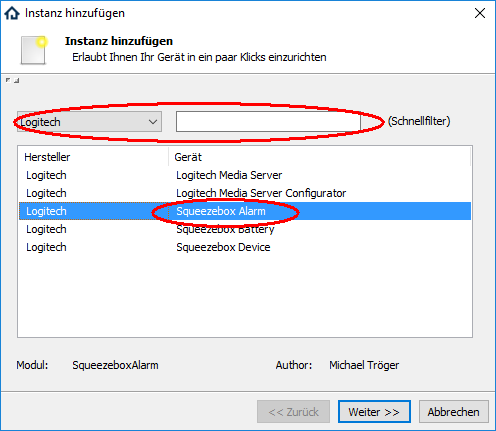
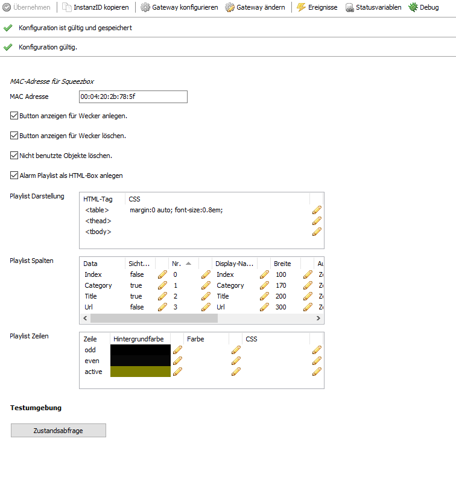
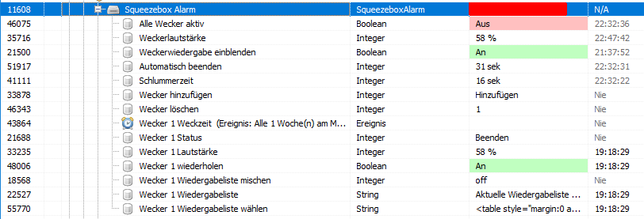
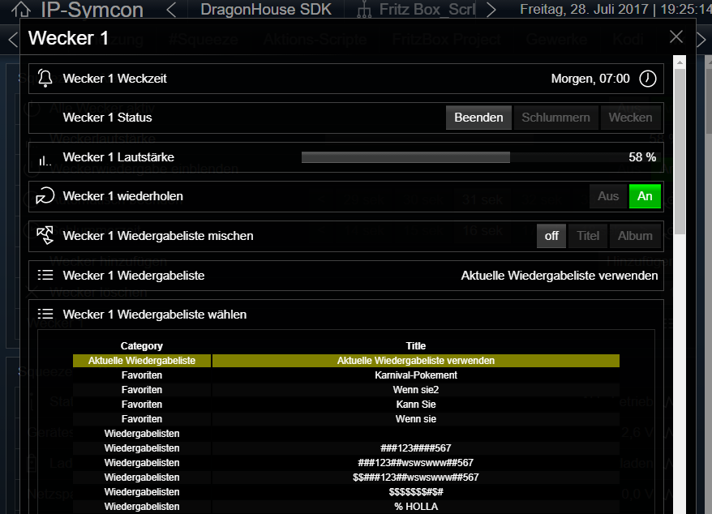

[](https://www.symcon.de/service/dokumentation/entwicklerbereich/sdk-tools/sdk-php/)
[]()
[](https://creativecommons.org/licenses/by-nc-sa/4.0/)  
[](https://www.symcon.de/forum/threads/30857-IP-Symcon-5-1-%28Stable%29-Changelog)
[](https://styleci.io/repos/38763445)  

# Squeezebox Alarm (Wecker)
Ermöglich die Steuerung sowie die Darstellung der Zustände  
von den in einer SqueezeBox eingerichteten Weckern in IPS.

## Dokumentation

**Inhaltsverzeichnis**

1. [Funktionsumfang](#1-funktionsumfang)  
2. [Voraussetzungen](#2-voraussetzungen)  
3. [Software-Installation](#3-software-installation)  
4. [Einrichten der Instanzen in IP-Symcon](#4-einrichten-der-instanzen-in-ip-symcon)  
5. [Statusvariablen und Profile](#5-statusvariablen-und-profile)  
6. [WebFront](#6-webfront)  
7. [PHP-Befehlsreferenz](#7-php-befehlsreferenz)  
    1. [Allgemeine Befehle](#1-allgemeine-befehle)  
    2. [Wecker Befehle](#2-wecker-befehle)  
8. [Lizenz](#8-lizenz)  

## 1. Funktionsumfang

 - Auslesen und darstellen der Wecker einer Squeezebox.
 - Steuern der Wecker über das WebFront und PHP-Befehlen.

## 2. Voraussetzungen

 - IPS 5.0 oder höher
 - Logitech Media Server (getestet ab 7.9.x)
 - kompatibler Player
 - Eingerichtete Splitter Instanz vom Typ 'Logitech Media Server' (LMS-Splitter)

## 3. Software-Installation

 Dieses Modul ist Bestandteil der IPSSqueezeBox-Library.  
   *Über das 'Modul Control' folgende URL hinzufügen:  
    `git://github.com/Nall-chan/IPSSqueezeBox.git`  

## 4. Einrichten der Instanzen in IP-Symcon

Eine einfache Einrichtung ist über den Konfigurator [Logitech Media Server Konfigurator](../../LMSConfigurator/readme.md) möglich.  
Bei der manuellen Einrichtung ist die Instanz im Dialog 'Instanz hinzufügen' unter dem Hersteller 'Logitech' zufinden.  
  

**Konfigurationsseite:**  
  

| Name                                | Eigenschaft       | Typ     | Standardwert | Funktion                                                      |
| :---------------------------------: | :---------------: | :-----: | :----------: | :-----------------------------------------------------------: |
| MAC-Adresse                         | Address           | string  |              | MAC Adresse der Squeezebox [Format xx:xx:xx:xx:xx:xx ]        |
| Button anzeigen für Wecker anlegen. | showAdd           | boolean | true         | de/aktiviert einen Button im WebFront für Wecker hinzufügen.  |
| Button anzeigen für Wecker löschen. | showDelete        | boolean | true         | de/aktiviert einen Button im WebFront für Wecker löschen.     |
| Nicht benutzte Objekte löschen.     | dynamicDisplay    | boolean | true         | aktiviert das automatische entfernen von Statusvariablen.     |
| Alarm Playlist als HTML-Box anlegen | showAlarmPlaylist | boolean | true         | de/aktiviert die Anzeige einer HTML-Box mit allen Playlisten. |
| Playlist Darstellung                | Table             | string  | Tabelle      | Style Eigenschaften der Playlist HTML-Tabelle.                |
| Playlist Spalten                    | Columns           | string  | Tabelle      | Style Eigenschaften der Playlist Spalten.                     |
| Playlist Zeilen                     | Rows              | string  | Tabelle      | Style Eigenschaften der Playlist Zeilen.                      |


## 5. Statusvariablen und Profile

Folgende Statusvariablen werden automatisch angelegt.
**Statusvariablen allgemein:**  

| Name                        | Typ     | Ident         | Beschreibung                                                  |
| :-------------------------: | :-----: | :-----------: | :-----------------------------------------------------------: |
| Alle Wecker aktiv           | boolean | EnableAll     | Globaler ein/aus Schalter aller Wecker dieses Gerätes.        |
| Weckerlautstärke            | integer | DefaultVolume | Standard Lautstärke beim erstellen eines neuen Weckers.       |
| Weckerwiedergabe einblenden | boolean | FadeIn        | Einblenden der Wiedergabe aktivieren / deaktivieren.          |
| Automatisch beenden         | integer | Timeout       | Zeit in Sekunden nach der ein Alarm automatisch beendet wird. |
| Schlummerzeit               | integer | SnoozeSeconds | Zeit in Sekunden für den Schlummertimer.                      |

**Ereignisse und Statusvariablen pro Wecker:**  

Werden pro in der Queezebox eingerichteten Wecker automatisch erzeugt.  
Wird ein Wecker in der SqueezeBox gelöscht, so werden bei konfigurierten Auto-Löschen die Variablen auch wieder entfernt.  
(X = Nummer vom Wecker)  

| Name                             | Typ     | Ident              | Beschreibung                                                               |
| :------------------------------: | :-----: | :----------------: | :------------------------------------------------------------------------: |
| Wecker X Weckzeit                | event   | AlarmTimeX         | tägliches Ereignis welches die Wochentage und Weckzeit des Weckers enthält |
| Wecker X Status                  | integer | AlarmStateX        | Der aktuelle Alarm-Status des Weckers                                      |
| Wecker X Wiedergabeliste         | string  | AlarmPlaylistNameX | Der Name der gewählten Playlist des Weckers.                               |
| Wecker X wiederholen             | boolean | AlarmRepeatX       | Alarmwiederholung ja / nein                                                |
| Wecker X Lautstärke              | integer | AlarmVolumeX       | Lautstärke des Weckers                                                     |
| Wecker X Wiedergabeliste mischen | integer | AlarmShuffleX      | Zufallsmodus des Weckers                                                   |
| Wecker X Wiedergabeliste wählen  | string  | AlarmPlaylistX     | HTML-Box mit allen verfügbaren Alarm-Playlisten                            |

  

**Profile**:

| Name          | Typ     | verwendet von Statusvariablen |
| :-----------: | :-----: | :---------------------------: |
| LSA.Intensity | integer | Lautstärke                    |
| LSA.Timeout   | integer | Automatisch beenden           |
| LSA.Snooze    | integer | Schlummerzeit                 |
| LSA.Shuffle   | integer | Wiedergabeliste mischen       |
| LSA.Add       | integer | Wecker hinzufügen             |
| LSA.Del.*     | integer | Wecker löschen                |
| LSA.State     | integer | Wecker Status                 |


## 6. WebFront

Es wird empfohlen für das WebFront mit Links und Dummy-Instanze bzw. Popup-Instanzen zu arbeiten.  
Die direkte Darstellung im WebFront ist zwar möglich, aber, je nach Konfiguration, auch schnell unübersichtlich.  
Beispiel mit einer Popup-Instanz und Links, dazu wurde alle Statusvariablen von Wecker 1 versteckt:  

  
  
  

## 7. PHP-Befehlsreferenz

Für alle Befehle gilt: Tritt ein Fehler auf, wird eine Warnung erzeugt.
Dies gilt auch wenn ein übergebender Wert für einen Parameter nicht gültig ist, oder außerhalb seines zulässigen Bereiches liegt.  

#### 1. Allgemeine Befehle:

```php
bool LSA_RequestState(int $InstanzID, string $Ident)
```
Fordert den Wert einer Statusvariable an.  
Es ist der Ident der Statusvariable zu übergeben.  
Es wird `true` zurückgeben wenn der Befehl vom Server bestätigt wurde,  
oder `false` im Fehlerfall.  

---

```php
bool LSA_SetAllActive(int $InstanzID, bool $Value)
```
De/Aktiviert die Wecker-Funktionen des Gerätes.  
`true` zum aktivieren, `false` zum deaktivieren.  
Es wird `true` zurückgeben wenn der Befehl vom Server bestätigt wurde,  
oder `false` im Fehlerfall.  

---

```php
bool LSA_SetDefaultVolume(int $InstanzID, int $Value)
```
Setzt die Standard-Lautstärke für neue Wecker.  
`true` zum aktivieren, `false` zum deaktivieren.  
Es wird `true` zurückgeben wenn der Befehl vom Server bestätigt wurde,  
oder `false` im Fehlerfall.  

---

```php
bool LSA_SetFadeIn(int $InstanzID, bool $Value)
```
De/Aktiviert das Einblenden der Wiedergabe.  
`true` zum aktivieren, `false` zum deaktivieren.  
Es wird `true` zurückgeben wenn der Befehl vom Server bestätigt wurde,  
oder `false` im Fehlerfall.  

---

```php
bool LSA_SetTimeout(int $InstanzID, int $Value)
```
Setzt die Zeit in Sekunden bis ein Wecker automatisch beendent wird.  
Es wird `true` zurückgeben wenn der Befehl vom Server bestätigt wurde,  
oder `false` im Fehlerfall.  

---

```php
bool LSA_SetSnoozeSeconds(int $InstanzID, int $Value)
```
Setzt die Schlummerzeit in Sekunden.  
Es wird `true` zurückgeben wenn der Befehl vom Server bestätigt wurde,  
oder `false` im Fehlerfall.  

---

```php
bool LSA_AlarmSnooze(int $InstanzID)
```
Sendet das Schlummersignal an das Gerät und pausiert somit einen aktiven Alarm.  
Es wird `true` zurückgeben wenn der Befehl vom Server bestätigt wurde,  
oder `false` im Fehlerfall.  

---

```php
bool LSA_AlarmStop(int $InstanzID)
```
Beendet ein aktiven Alarm.  
Es wird `true` zurückgeben wenn der Befehl vom Server bestätigt wurde,  
oder `false` im Fehlerfall.  

---

```php
int|bool LSA_AddAlarm(int $InstanzID)
```
Erzeugt einen neuen Wecker.  
Es wird der Index des neuen Weckers zurückgegeben, im Fehlerfall false.  
Achtung Prüfung auf === false sinnvoll, da es auch den Index 0 gibt!  

#### 2. Wecker-Befehle:  

**Der Index wird in $AlarmIndex übergeben und beginnt mit 0 für den ersten Wecker.**  

```php
bool LSA_DelAlarm(int $InstanzID, int $AlarmIndex)
```
Löscht einen Wecker.  
Es wird `true` zurückgeben wenn der Befehl vom Server bestätigt wurde,  
oder `false` im Fehlerfall.  

---

```php
bool LSA_SetPlaylist(int $InstanzID, int $AlarmIndex, string $Url)
```
Setzt die Playliste bzw. die Wiedergabe für den Wecker.  
Die wiederzugebene URL muss in $Url übergeben werden.  
Es wird `true` zurückgeben wenn der Befehl vom Server bestätigt wurde,  
oder `false` im Fehlerfall.  

---

```php
bool LSA_SetShuffle(int $InstanzID, int $AlarmIndex, int $Value)
```
Setzt den Modus der zufälligen Wiedergabe des Weckers.  
Der Modus wird in $Value übergeben und kann 0=aus, 1=Titel oder 2=Album enthalten.
Es wird `true` zurückgeben wenn der Befehl vom Server bestätigt wurde,  
oder `false` im Fehlerfall.  

---

```php
bool LSA_SetRepeat(int $InstanzID, int $AlarmIndex, bool $Value)
```
De/Aktiviert die Wiederholung.  
`true` zum aktivieren, `false` zum deaktivieren.  
Es wird `true` zurückgeben wenn der Befehl vom Server bestätigt wurde,  
oder `false` im Fehlerfall.  

---

```php
bool LSA_SetVolume(int $InstanzID, int $AlarmIndex, int $Value)
```
Setzt die Lautstärke des Weckers.  
Es wird `true` zurückgeben wenn der Befehl vom Server bestätigt wurde,  
oder `false` im Fehlerfall.  

## 8. Lizenz

  IPS-Modul:  
  [CC BY-NC-SA 4.0](https://creativecommons.org/licenses/by-nc-sa/4.0/)  
