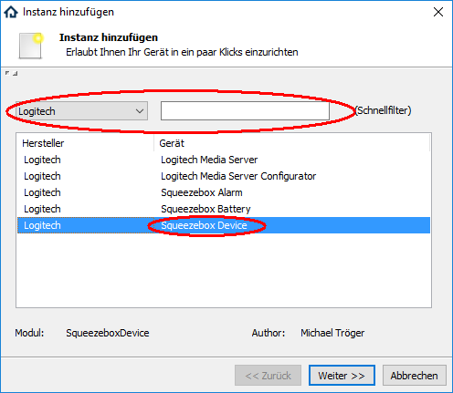
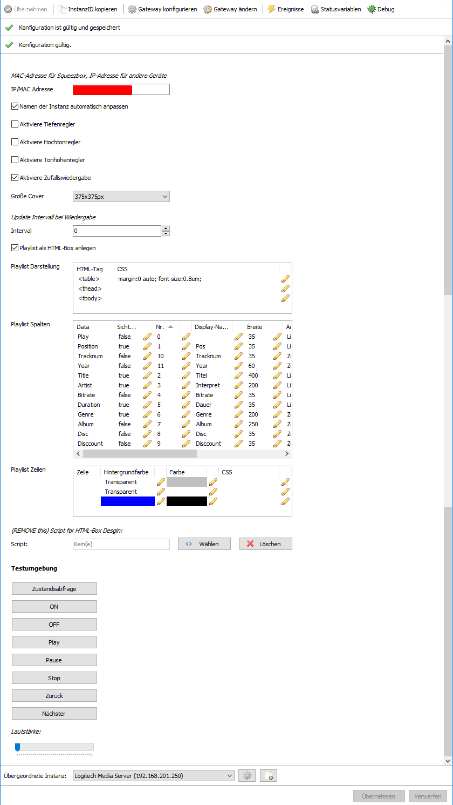
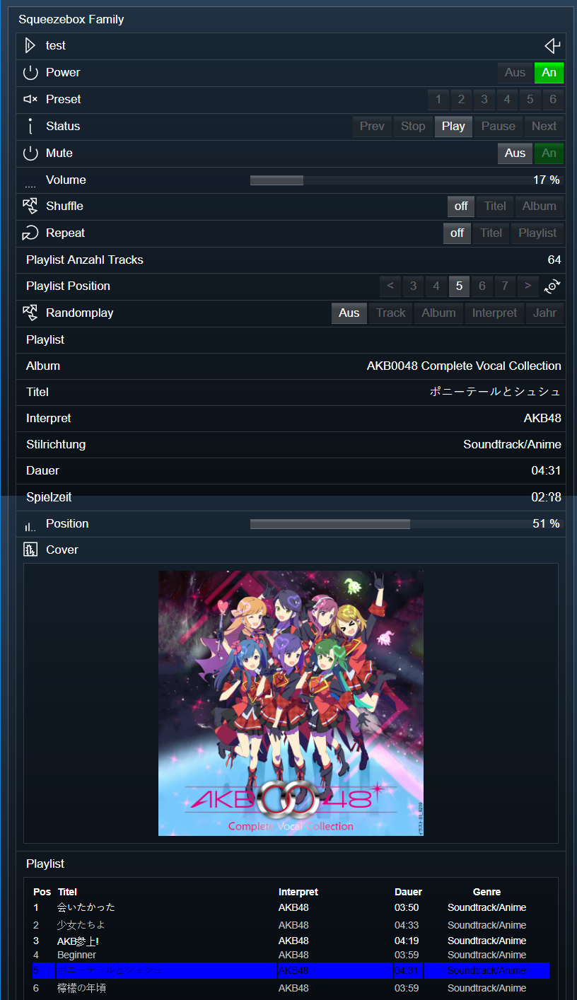
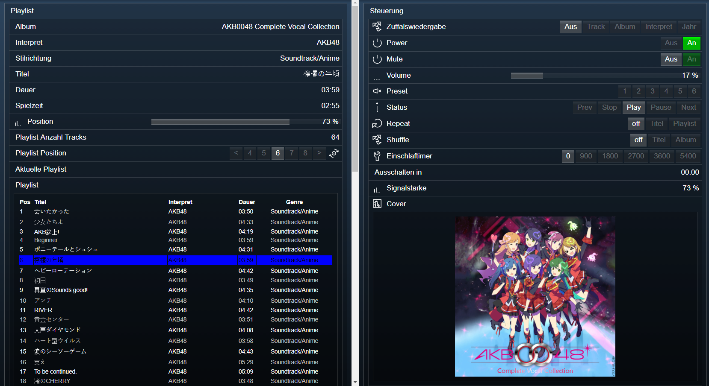

[](https://www.symcon.de/service/dokumentation/entwicklerbereich/sdk-tools/sdk-php/)
[]()
[](https://creativecommons.org/licenses/by-nc-sa/4.0/)  
[](https://www.symcon.de/forum/threads/30857-IP-Symcon-5-1-%28Stable%29-Changelog)
[](https://styleci.io/repos/38763445)  

# SqueezeBox Player (SqueezeBoxDevice)  

Ermöglich die Steuerung sowie die Darstellung der Zustände
von SqueezeBox Geräten in IPS, in Verbindung mit dem
Logitech Media Server.  

## Dokumentation

**Inhaltsverzeichnis**

1. [Funktionsumfang](#1-funktionsumfang)  
2. [Voraussetzungen](#2-voraussetzungen)  
3. [Software-Installation](#3-software-installation)  
4. [Einrichten der Instanzen in IP-Symcon](#4-einrichten-der-instanzen-in-ip-symcon)  
5. [Statusvariablen und Profile](#5-statusvariablen-und-profile)  
6. [WebFront](#6-webfront)  
7. [PHP-Befehlsreferenz](#7-php-befehlsreferenz)   
    1. [Allgemein](#1-allgemein)
    2. [Steuerung](#2-steuerung)
    3. [Playlist](#3-playlist)
    4. [Zufallswiedergabe](#4-zufallswiedergabe)
8. [Lizenz](#8-lizenz)

## 1. Funktionsumfang

 - Steuern und Abfragen der diversen verschiedenen Zustände und Eigenschaften.  
 - Abfragen, Laden, bearbeiten und speichern von der internen Playliste des Gerätes.  
 - Syncronisierung steuern.  
 - Fähigkeiten über das WebFront:  
    *  Modus: Play,Pause, Stop
    *  Audio: Lautstärke mit Stummschaltung, und wenn vom Gerät unterstützt, auch Tonhöhe sowie Höhen und Bass.
    *  Bedienung der 6 Preset-Tasten vom Gerät
    *  Sleeptimer: Setzen und löschen des Timer.
    *  Playlist: Trackanwahl, nächster, vorheriger Track, Widerholung und Zufallsmodus
    *  Darstellung der Daten zum aktuellen Track: Titel, Album, Interpret, Stilrichtung, Cover etc..
    *  Darstellen der Server-Playlisten sowie laden derselben auf Player.

## 2. Voraussetzungen

 - IPS 5.0 oder höher
 - Logitech Media Server (getestet ab 7.9.x)
 - kompatibler Player

## 3. Software-Installation  

 Dieses Modul ist Bestandteil der IPSSqueezeBox-Library.  
   Bei privater Nutzung: Über das 'Module-Control' in IPS folgende URL hinzufügen.  
    `git://github.com/Nall-chan/IPSSqueezeBox.git`  

   **Bei kommerzieller Nutzung (z.B. als Errichter oder Integrator) wenden Sie sich bitte an den Autor.**  

## 4. Einrichten der Instanzen in IP-Symcon

Eine einfache Einrichtung ist über den Konfigurator [Logitech Media Server Konfigurator](../../LMSConfigurator/readme.md) möglich.  
Bei der manuellen Einrichtung ist die Instanz im Dialog 'Instanz hinzufügen' unter dem Hersteller 'Logitech' zufinden.  
  

**Konfigurationsseite:**  
  

| Name                                   | Eigenschaft       | Typ     | Standardwert | Funktion                                                              |
| :------------------------------------: | :---------------: | :-----: | :----------: | :-------------------------------------------------------------------: |
| IP/MAC-Adresse                         | Address           | string  |              | MAC Adresse der Squeezebox [Format xx:xx:xx:xx:xx:xx ]                |
| Namen der Instanz automatisch anpassen | changeName        | boolean | false        | Instanz automatisch umbenennen wenn der Name vom Gerät sich ändert.   |
| Aktiviere Tiefenregler                 | enableBass        | boolean | true         | Statusvariablen für Tiefenregler anlegen.                             |
| Aktiviere Hochtonregler                | enableTreble      | boolean | true         | Statusvariablen für Hochtonregler anlegen.                            |
| Aktiviere Tonhöhenregler               | enablePitch       | boolean | true         | Statusvariablen für Tonhöhenregler anlegen.                           |
| Aktiviere Zufallswiedergabe            | enableRandomplay  | boolean | true         | Statusvariablen für Zufallswiedergabe anlegen.                        |
| Größe Cover                            | CoverSize         | string  | cover        | Größe vom Cover:  cover  cover150x150  cover300x300                   |
| Update Interval bei Wiedergabe         | Interval          | integer | 2            | Abstand in welchen der LMS aktuelle Daten bei der Wiedergabe liefert. |
| Playlist als HTML-Box anlegen          | showPlaylist      | boolean | true         | Aktiviert die Darstellung der Playlist als HTML-Box.                  |
| Playlist Darstellung                   | Table             | string  | Tabelle      | Style Eigenschaften der Playlist HTML-Tabelle.                        |
| Playlist Spalten                       | Columns           | string  | Tabelle      | Style Eigenschaften der Playlist Spalten.                             |
| Playlist Zeilen                        | Rows              | string  | Tabelle      | Style Eigenschaften der Playlist Zeilen.                              |


## 5. Statusvariablen und Profile

Folgende Statusvariablen werden automatisch angelegt.  
**Statusvariablen allgemein:**  

| Name                   | Typ     | Ident          | Beschreibung                                              |
| :--------------------: | :-----: | :------------: | :-------------------------------------------------------: |
| Player verbunden       | boolean | Connected      | True wenn der Player mit dem Server verbunden ist         |
| Power                  | boolean | Power          | Player ein- oder ausgeschaltet                            |
| Status                 | integer | Status         | Wiedergabemodus: Play, Pause, Stop                        |
| Preset                 | integer | Preset         | Aktionsbutton für das WebFront um einen Preset auszurufen |
| Mute                   | boolean | Mute           | Stummschaltung aktiv / deaktiv                            |
| Volume                 | integer | Volume         | Lautstärke                                                |
| Bass                   | integer | Bass           | Regler für Bass                                           |
| Hochtonregler          | integer | Treble         | Regler für Hochton                                        |
| Pitch                  | integer | Pitch          | Regler für Tonhöhen                                       |
| Zufallswiedergabe      | integer | Randomplay     | Modus der Zufallswiedergabe                               |
| Mischen                | integer | Shuffle        | Aktuelle Playlist mischen                                 |
| Wiederholen            | integer | Repeat         | Aktuelle Playlist wiederholen                             |
| Playlist Anzahl Tracks | integer | Tracks         | Aktuelle Anzahl der Tracks in der Playlist                |
| Playlist               | string  | Playlistname   | Name der Playlist oder Remote-Stream, sofern vorhanden    |
| Album                  | string  | Album          | Album des Tracks der aktuellen Wiedergabe                 |
| Titel                  | string  | Title          | Titel des Tracks der aktuellen Wiedergabe                 |
| Interpret              | string  | Artist         | Interpret des Tracks der aktuellen Wiedergabe             |
| Stilrichtung           | string  | Genre          | Stilrichtung des Tracks der aktuellen Wiedergabe          |
| Dauer                  | string  | Duration       | Spielzeit des Tracks der aktuellen Wiedergabe             |
| Spielzeit              | string  | Position       | Aktuelle Postion im Track als Klartext                    |
| Position               | integer | Position2      | Aktuelle Postion im Track in Prozent                      |
| Signalstärke           | integer | Signalstrength | WLAN-Signalstärke des Players, sofern vorhanden           |
| Einschlaftimer         | integer | SleepTimer     | Gewählter Zeitraum für Einschlaftimer                     |
| Ausschalten in         | string  | SleepTimeout   | Zeit bis zum Auschalten                                   |
| Playlist               | string  | Playlist       | HTML-Box mit der Playlist des Players                     |

**Profile**:

| Name            | Typ     | verwendet von Statusvariablen |
| :-------------: | :-----: | :---------------------------: |
| LSQ.Status      | integer | Status                        |
| LSQ.Intensity   | integer | Alle 0-100 Slider             |
| LSQ.Pitch       | integer | Pitch                         |
| LSQ.Shuffle     | integer | Shuffle                       |
| LSQ.Repeat      | integer | Repeat                        |
| LSQ.Preset      | integer | Preset                        |
| LSQ.SleepTimer  | integer | SleepTimer                    |
| LSQ.Randomplay  | integer | Randomplay                    |
| LSQ.Tracklist.* | integer | Tracks                        |


## 6. WebFront

Die direkte Darstellung im WebFront ist möglich, es wird aber empfohlen mit Links zu arbeiten.  
  

Hier ein Beispiel mit einer Splitpane und zwei Dummy-Instanzen (Playlist & Steuerung) welche Links zu den Statusvariablen und dem Cover enthalten.  
  

## 7. PHP-Befehlsreferenz

Für alle Befehle gilt:  
Tritt ein Fehler auf, wird eine Warnung erzeugt.  
Dies gilt auch wenn ein übergebender Wert für einen Parameter nicht gültig ist, oder außerhalb seines zulässigen Bereiches liegt.  

### 1. Allgemein

```php
string LSQ_GetName(int $InstanzID)
```
Liefert den Namen des Players.  
Im Fehlerfall wird `false` zurückgegeben.  

---

```php
bool LSQ_SetName(int $InstanzID, string $Name)
```
Setzt den Namen des Players auf `$Name`.  
Liefert `true` bei Erfolg, sonst `false`.  

---

```php
bool LSQ_RequestState(int $InstanzID, string $Ident)
```
Fordert den Wert einer Statusvariable an.  
Es ist der Ident der Statusvariable zu übergeben.  
Es wird `true` zurückgeben wenn der Befehl vom Server bestätigt wurde,  
oder `false` im Fehlerfall.  


### 2. Steuerung

```php
bool LSQ_Power(int $InstanzID, bool $Value)
```
Schaltet das Gerät ein `true` oder aus `false`.  
Liefert `true` bei Erfolg, sonst `false`.  

---

```php
bool LSQ_Play(int $InstanzID)
bool LSQ_PlayEx(int $InstanzID, int $FadeIn)
```
Startet die Wiedergabe.  
Mit LSQ_PlayEx kann ein `$FadeIn` in Sekunden übergeben werden.  
Liefert `true` bei Erfolg, sonst `false`.  

---

```php
bool LSQ_Pause(int $InstanzID)
```
Pausiert die Wiedergabe.  
Liefert `true` bei Erfolg, sonst `false`.  

---

```php
bool LSQ_Stop(int $InstanzID)
```
Stoppt die Wiedergabe.  
Liefert `true` bei Erfolg, sonst `false`.  

---

```php
bool LSQ_SetVolume(int $InstanzID, int $Value)
```
Setzt die Lautstärke auf `$Value`.  
Liefert `true` bei Erfolg, sonst `false`.  

---

```php
bool LSQ_SetMute(int $InstanzID, bool $Value)
```
Stummschaltung aktiv `true`oder deaktiv `false`.  
Liefert `true` bei Erfolg, sonst `false`.  

---

```php
bool LSQ_SetPosition(int $InstanzID, int $Value)
```
Springt im aktuellen Track auf die Zeit in Sekunden von `$Value`.  
Liefert `true` bei Erfolg, sonst `false`.  

---

```php
bool LSQ_SetBass(int $InstanzID, int $Value)
bool LSQ_SetTreble(int $InstanzID, int $Value)
bool LSQ_SetPitch(int $InstanzID, int $Value)
```
Setzt den Bass, die Höhen oder Tonhöhen auf `$Value`. (Pitch nur bei SliMP3 & SqueezeBox1 / SB1 )  
Liefert `true` bei Erfolg, sonst `false`.  

---

```php
bool LSQ_SetSleep(int $InstanzID, int $Seconds)
```
Aktiviert den (Ein)Schlafmodus mit der unter `$Seconds`angegeben Sekunden.  
0 deaktiviert den zuvor gesetzten Schlafmodus.  
Liefert `true` bei Erfolg, sonst `false`.  

---

```php
bool LSQ_PreviousButton(int $InstanzID)
bool LSQ_NextButton(int $InstanzID)
```
Simuliert einen Tastendruck auf den Vorwärts bzw. Rückwerts-Button des Gerätes.  
Liefert `true` bei Erfolg, sonst `false`.  

---

```php
bool LSQ_PressButton(int $InstanzID)
```
Simuliert einen Tastendruck der TODO  
Liefert `true` bei Erfolg, sonst `false`.  

---

```php
bool LSQ_SelectPreset(int $InstanzID, int $Value)
```
Simuliert einen Tastendruck der Preset-Tasten 1-6 `$Value`.  
Liefert `true` bei Erfolg, sonst `false`.  

---

```php
bool LSQ_DisplayLine(int $InstanzID, string $Text, int $Duration)
bool LSQ_DisplayLineEx(int $InstanzID, string $Text, int $Duration, bool $Centered, int $Brightness)
bool LSQ_Display2Lines(int $InstanzID, string $Text1, string $Text2, int $Duration)
bool LSQ_Display2LinesEx(int $InstanzID, string $Text1, string $Text2, int $Duration, bool $Centered, int $Brightness)
```
TODO  
Liefert `true` bei Erfolg, sonst `false`.  

---

```php
bool LSQ_DisplayText(int $InstanzID, string $Text1, string $Text2, int $Duration)
```
TODO  
Liefert `true` bei Erfolg, sonst `false`.  

---

```php
int LSQ_GetLinesPerScreen(int $InstanzID)
```
TODO  

---

```php
LSQ_GetDisplayedText(int $InstanzID)
LSQ_GetDisplayedNow(int $InstanzID)
```
TODO  

### 3. Playlist

```php
LSQ_PlayUrl(int $InstanzID, string $URL)
LSQ_PlayUrlEx(int $InstanzID, string $URL, string $DisplayTitle)
```

---

```php
bool LSQ_PlayFavorite(int $InstanzID, string $FavoriteID)
```
Liefert `true` bei Erfolg, sonst `false`.  

---

```php
bool LSQ_SetShuffle(int $InstanzID, int $Value)
```
Setzt dem Modus für die zufällige Wiedergabe. `$Value` kann die Werte 0 für aus,  
1 für den alle Titel in der Playlist, oder 2 für das die verschiednen Alben in der Playlist enthalten.  
Liefert `true` bei Erfolg, sonst `false`.  

---

```php
bool LSQ_SetRepeat(int $InstanzID, int $Value)
```
Setzt dem Modus für Wiederholungen. `$Value` kann die Werte 0 für aus,  
1 für den aktuellen Titel, oder 2 für die aktuelle Playlist enthalten.  
Liefert `true` bei Erfolg, sonst `false`.  

---

```php
bool LSQ_GoToTrack(int $InstanzID, int $Index)
```
Springt in der Playlist auf den mit `$Index` übergebe Position.  
Liefert `true` bei Erfolg, sonst `false`.  

---

```php
bool LSQ_NextTrack(int $InstanzID)
bool LSQ_PreviousTrack(int $InstanzID)
```
Springt in der Playlist auf den vorherigen bzw. nächsten Track.  
Liefert `true` bei Erfolg, sonst `false`.  

---

```php
string LSQ_LoadPlaylist(int $InstanzID, string $Name)
```
Lädt die unter `$Name`übergebene Playlist.  
Die Wiedergabe wird nicht automatisch gestartet.  
Liefert den Pfad der Playlist.  

---

```php
string LSQ_ResumePlaylist(int $InstanzID, string $Name)
```
Lädt die unter `$Name`übergebene Playlist, und springt auf den zuletzt wiedergegeben Track.  
Die Wiedergabe wird nicht automatisch gestartet.  
Liefert den Pfad der Playlist.  
---

```php
LSQ_LoadPlaylistBySearch(int $InstanzID, string $Genre, string $Artist, string $Album)
```

---

```php
LSQ_LoadPlaylistByTrackTitel(int $InstanzID, string $Titel)
LSQ_LoadPlaylistByAlbumTitel(int $InstanzID, string $Titel)
LSQ_LoadPlaylistByArtistName(int $InstanzID, string $Name)
```

---

```php
bool LSQ_LoadPlaylistByFavoriteID(int $InstanzID, string $FavoriteID)
bool LSQ_LoadPlaylistByAlbumID(int $InstanzID, int $AlbumID)
bool LSQ_LoadPlaylistByGenreID(int $InstanzID, int $GenreID)
bool LSQ_LoadPlaylistByArtistID(int $InstanzID, int $ArtistID)
bool LSQ_LoadPlaylistByPlaylistID(int $InstanzID, int $PlaylistID)
bool LSQ_LoadPlaylistByFolderID(int $InstanzID, int $FolderID)
```
Lädt eine Playlist bestehend aus der inm zweiten Parameter übergebeneb ID.  
Liefert `true` bei Erfolg, sonst `false`.  

---

```php
LSQ_LoadPlaylistBySongIDs(int $InstanzID, string $SongIDs)
```

---

```php
bool LSQ_SavePlaylist(int $InstanzID, string $Name)
```
Speichert eine Playlist unter den mit `$Name` übergebenen Namen.   
Liefert `true` bei Erfolg, sonst `false`.  

---

```php
bool LSQ_SaveTempPlaylist(int $InstanzID)
```
Speichert eine temporäre Playlist, welche beim Laden per LSQ_LoadTempPlaylist automatisch vom Server gelöscht wird.  
Eine zuvor nicht geladene temporäre Playlist wird dabei überschrieben.  
Liefert `true` bei Erfolg, sonst `false`.  

---

```php
bool LSQ_LoadTempPlaylist(int $InstanzID)
```
Lädt eine zuvor mit LSQ_SaveTempPlaylist gespeicherte Playlist, und springt auf den zuletzt wiedergegeben Track.  
Die Wiedergabe wird nicht automatisch gestartet.  
Liefert `true` bei Erfolg, sonst `false`.  

---

```php
LSQ_AddToPlaylistByUrl(int $InstanzID, string $URL)
LSQ_AddToPlaylistByUrlEx(int $InstanzID, string $URL, string $DisplayTitle)
```

---

```php
LSQ_AddToPlaylistBySearch(int $InstanzID, string $Genre, string $Artist, string $Album)
```

---

```php
LSQ_AddToPlaylistByTrackTitel(int $InstanzID, string $Titel)
LSQ_AddToPlaylistByAlbumTitel(int $InstanzID, string $Titel)
LSQ_AddToPlaylistByArtistName(int $InstanzID, string $Name)
```

---

```php
LSQ_AddToPlaylistByFavoriteID(int $InstanzID, string $FavoriteID)
LSQ_AddToPlaylistByAlbumID(int $InstanzID, int $AlbumID)
LSQ_AddToPlaylistByGenreID(int $InstanzID, int $GenreID)
LSQ_AddToPlaylistByArtistID(int $InstanzID, int $ArtistID)
LSQ_AddToPlaylistByPlaylistID(int $InstanzID, int $PlaylistID)
LSQ_AddToPlaylistByFolderID(int $InstanzID, int $FolderID)
```

---

```php
LSQ_AddToPlaylistBySongIDs(int $InstanzID, string $SongIDs)
```

---

```php
LSQ_DeleteFromPlaylistBySearch(int $InstanzID, string $Genre, string $Artist, string $Album)
```

---

```php
LSQ_DeleteFromPlaylistByIndex(int $InstanzID, int $Position)
```

---

```php
LSQ_DeleteFromPlaylistByUrl(int $InstanzID, string $URL)
```

---

```php
LSQ_DeleteFromPlaylistByAlbumID(int $InstanzID, int $AlbumID)
LSQ_DeleteFromPlaylistByGenreID(int $InstanzID, int $GenreID)
LSQ_DeleteFromPlaylistByArtistID(int $InstanzID, int $ArtistID)
LSQ_DeleteFromPlaylistByPlaylistID(int $InstanzID, int $PlaylistID)
LSQ_DeleteFromPlaylistBySongIDs(int $InstanzID, string $SongIDs)
```

---

```php
LSQ_MoveSongInPlaylist(int $InstanzID, int $Position, int $NewPosition)
```

---

```php
LSQ_InsertInPlaylistBySearch(int $InstanzID, string $Genre, string $Artist, string $Album)
```

---

```php
LSQ_InsertInPlaylistByAlbumID(int $InstanzID, int $AlbumID)
LSQ_InsertInPlaylistByGenreID(int $InstanzID, int $GenreID)
LSQ_InsertInPlaylistByArtistID(int $InstanzID, int $ArtistID)
LSQ_InsertInPlaylistByPlaylistID(int $InstanzID, int $PlaylistID)
LSQ_InsertInPlaylistByFolderID(int $InstanzID, int $FolderID)
LSQ_InsertInPlaylistByFavoriteID(int $InstanzID, string $FavoriteID)
```

---

```php
LSQ_InsertInPlaylistBySongIDs(int $InstanzID, string $SongIDs)
```

---

```php
LSQ_PreviewPlaylistStart(int $InstanzID, string $Name)
LSQ_PreviewPlaylistStop(int $InstanzID)
```

---

```php
LSQ_ClearPlaylist(int $InstanzID)
```

---

```php
LSQ_GetPlaylistURL(int $InstanzID)
```

---

```php
LSQ_IsPlaylistModified(int $InstanzID)
```

---

```php
LSQ_AddPlaylistIndexToZappedList(int $InstanzID, int $Position)
```

---

```php
array LSQ_GetPlaylistInfo(int $InstanzID)
```
Liefert Informationen über die Playlist.  
**Hinweis:**
Funktioniert nur, wenn wirklich eine Playlist aus den vorhandnene Server-Playlisten geladen wurde.  
Und auch nur, wenn Sie manuell am Player oder per `LSQ_LoadPlaylistByPlaylistID` geladen wurde.
Playlisten welche mit ihrem Namen über `LSQ_LoadPlaylist` geladen wurden, liefern leider keine Informationen.  

**Array:**  

| Index     | Typ     | Beschreibung                          |
| :-------: | :-----: | :-----------------------------------: |
| Id        | integer | UID der Playlist in der LMS-Datenbank |
| Name      | string  | Name der Playlist                     |
| Modified  | boolean | `true` wenn Playlist verändert wurde  |
| Url       | string  | Pfad der Playlist                     |


---

```php
array LSQ_GetSongInfoByTrackIndex(int $InstanzID, int $Index)
```
Liefert Informationen über den Song mit dem `$Index` der aktuellen Playlist.  
Wird als `$Index` 0 übergeben, so wird der aktuelle Song genutzt.  

**Array:**  

| Index            | Typ     | Beschreibung                        |
| :--------------: | :-----: | :---------------------------------: |
| Id               | integer | UID der Datei in der LMS-Datenbank  |
| Title            | string  | Titel                               |
| Genre            | string  | Genre                               |
| Album            | string  | Album                               |
| Artist           | string  | Interpret                           |
| Duration         | integer | Länge in Sekunden                   |
| Disc             | integer | Aktuelles Medium                    |
| Disccount        | integer | Anzahl aller Medien dieses Albums   |
| Bitrate          | string  | Bitrate in Klartext                 |
| Tracknum         | integer | Tracknummer im Album                |
| Url              | string  | Pfad der Playlist                   |
| Album_id         | integer | UID des Album in der LMS-Datenbank  |
| Artwork_track_id | string  | UID des Cover in der LMS-Datenbank  |
| Genre_id         | integer | UID des Genre in der LMS-Datenbank  |
| Artist_id        | integer | UID des Artist in der LMS-Datenbank |
| Year             | integer | Jahr des Song, soweit hinterlegt    |
| Remote_title     | string  | Titel des Stream                    |

---

```php
array LSQ_GetSongInfoOfCurrentPlaylist(int $InstanzID)
```
Liefert Informationen über alle Songs in der Playlist.  
Mehrdimensionales Array, wobei der erste Index der Trackposition entspricht.  

**Array:**  

| Index            | Typ     | Beschreibung                        |
| :--------------: | :-----: | :---------------------------------: |
| Id               | integer | UID der Datei in der LMS-Datenbank  |
| Title            | string  | Titel                               |
| Genre            | string  | Genre                               |
| Album            | string  | Album                               |
| Artist           | string  | Interpret                           |
| Duration         | integer | Länge in Sekunden                   |
| Disc             | integer | Aktuelles Medium                    |
| Disccount        | integer | Anzahl aller Medien dieses Albums   |
| Bitrate          | string  | Bitrate in Klartext                 |
| Tracknum         | integer | Tracknummer im Album                |
| Url              | string  | Pfad der Playlist                   |
| Album_id         | integer | UID des Album in der LMS-Datenbank  |
| Artwork_track_id | string  | UID des Cover in der LMS-Datenbank  |
| Genre_id         | integer | UID des Genre in der LMS-Datenbank  |
| Artist_id        | integer | UID des Artist in der LMS-Datenbank |
| Year             | integer | Jahr des Song, soweit hinterlegt    |
| Remote_title     | string  | Titel des Stream                    |


### 4. Zufallswiedergabe

```php
LSQ_StartRandomplayOfTracks(int $InstanzID)
LSQ_StartRandomplayOfAlbums(int $InstanzID)
LSQ_StartRandomplayOfArtist(int $InstanzID)
LSQ_StartRandomplayOfYear(int $InstanzID)
```

---

```php
LSQ_StopRandomplay(int $InstanzID)
```

---

```php
LSQ_RandomplaySelectAllGenre(int $InstanzID, bool $Active)
```

---

```php
LSQ_RandomplaySelectGenre(int $InstanzID, string $Genre, bool $Active)
```

## 8. Lizenz

  IPS-Modul:  
  [CC BY-NC-SA 4.0](https://creativecommons.org/licenses/by-nc-sa/4.0/)  
