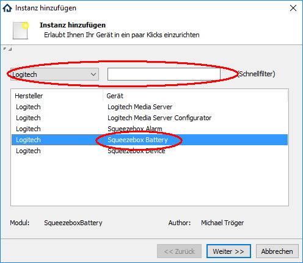
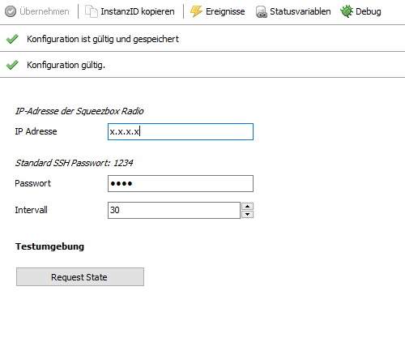

[](https://www.symcon.de/service/dokumentation/entwicklerbereich/sdk-tools/sdk-php/)
[]()
[](https://creativecommons.org/licenses/by-nc-sa/4.0/)  
[](https://www.symcon.de/forum/threads/30857-IP-Symcon-5-1-%28Stable%29-Changelog)
[](https://styleci.io/repos/38763445)  

# Squeezebox Battery
Daten zur Stromversorgung und des Akkus in IPS einbinden.  

## Dokumentation

**Inhaltsverzeichnis**

1. [Funktionsumfang](#1-funktionsumfang)  
2. [Voraussetzungen](#2-voraussetzungen)  
3. [Software-Installation](#3-software-installation) 
4. [Einrichten der Instanzen in IP-Symcon](#4-einrichten-der-instanzen-in-ip-symcon)
5. [Statusvariablen und Profile](#5-statusvariablen-und-profile)
6. [WebFront](#6-webfront)
7. [PHP-Befehlsreferenz](#7-php-befehlsreferenz) 
8. [Lizenzen](#8-lizenzen)

## 1. Funktionsumfang

 - Auslesen und darstellen von Werten der Stromversorgung und des Akkumulators.  

## 2. Voraussetzungen

 - IPS 5.0 oder höher
 - kompatibler Player mit aktivierten SSH-Zugang  

## 3. Software-Installation

 Dieses Modul ist Bestandteil der IPSSqueezeBox-Library.  
   *Über das 'Modul Control' folgende URL hinzufügen:  
    `git://github.com/Nall-chan/IPSSqueezeBox.git`  

## 4. Einrichten der Instanzen in IP-Symcon

Das Modul ist im Dialog 'Instanz hinzufügen' unter dem Hersteller 'Logitech' zufinden.  
  

**Konfigurationsseite:**  
  

| Name       | Eigenschaft | Typ     | Standardwert | Funktion                    |
| :--------: | :---------: | :-----: | :----------: | :-------------------------: |
| IP Adresse | Address     | string  |              | IP-Adresse der Squeezebox   |
| Passwort   | Password    | string  | 1234         | Passwort für den SSH-Zugang |
| Intervall  | Interval    | integer | 30           | Abfrageintervall            |


## 5. Statusvariablen und Profile

Folgende Statusvariablen werden automatisch angelegt.
**Statusvariablen:**  

| Name               | Typ     | Ident              | Beschreibung                     |
| :----------------: | :-----: | :----------------: | :------------------------------: |
| Status             | integer | State              | Status der Stromversorgung       |
| Gerätespannung     | float   | SysVoltage         | Interne Gerätespannung           |
| Netzspannung       | float   | WallVoltage        | Spannung vom externen Anschluss  |
| Ladestatus         | integer | ChargeState        | Aktueller Betriebsmodus des Akku |
| Akkuladekapazität  | float   | BatteryLevel       | in Prozent                       |
| Akkutemperatur     | float   | BatteryTemperature | in °C                            |
| Akkuspannung Summe | float   | BatteryVoltage     | in Volt                          |
| Akkuspannung 1     | float   | BatteryVMon1       | in Volt                          |
| Akkuspannung 2     | float   | BatteryVMon2       | in Volt                          |
| Akkukapazität      | integer | BatteryCapacity    | in mAh                           |

**Profile**:

| Name        | Typ     | verwendet von Statusvariablen |
| :---------: | :-----: | :---------------------------: |
| LSQB.Power  | integer | Status                        |
| LSQB.Charge | integer | Ladestatus                    |
| LSQB.mAh    | integer | Akkukapazität                 |


## 6. WebFront

Die direkte Darstellung der Instanz im WebFront:  
  

## 7. PHP-Befehlsreferenz

```php
bool LSQB_RequestState(int $InstanzID)
```
Aktuellen Status aus dem Gerät auslesen.  
Es wird `true` zurückgeben wenn die Abfrage erfolgreich war,  
oder `false` im Fehlerfall.  


## 8. Lizenzen

  IPS-Modul:  
  [CC BY-NC-SA 4.0](https://creativecommons.org/licenses/by-nc-sa/4.0/)  

  phpseclib from Jim Wigginton <terrafrost@php.net>  
   [MIT License](http://www.opensource.org/licenses/mit-license.html)  
   Link: [http://phpseclib.sourceforge.net](http://phpseclib.sourceforge.net)  
 