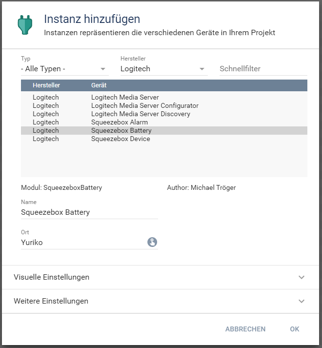
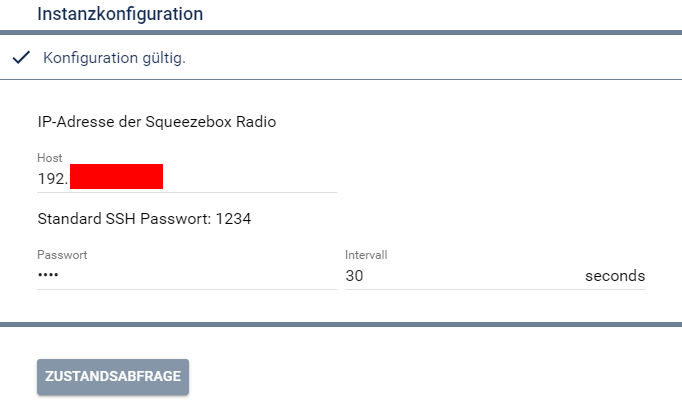
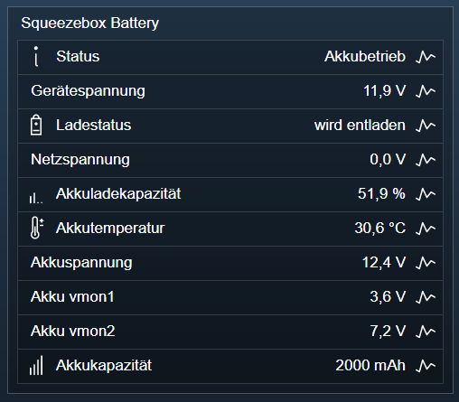
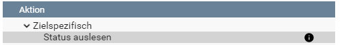

[](https://www.symcon.de/service/dokumentation/entwicklerbereich/sdk-tools/sdk-php/)
[](https://community.symcon.de/t/modul-squeezebox-release/46937)
[](https://www.symcon.de/service/dokumentation/installation/migrationen/)  
[](https://creativecommons.org/licenses/by-nc-sa/4.0/)
[](https://github.com/Nall-chan/SqueezeBox/actions) [](https://github.com/Nall-chan/SqueezeBox/actions)  
[](#2-spenden)  
# Squeezebox Battery  <!-- omit in toc -->
Daten zur Stromversorgung und des Akkus in IPS einbinden.  

## Dokumentation  <!-- omit in toc -->

**Inhaltsverzeichnis**

- [1. Funktionsumfang](#1-funktionsumfang)
- [2. Voraussetzungen](#2-voraussetzungen)
- [3. Software-Installation](#3-software-installation)
- [4. Einrichten der Instanzen in IP-Symcon](#4-einrichten-der-instanzen-in-ip-symcon)
- [5. Statusvariablen und Profile](#5-statusvariablen-und-profile)
- [6. WebFront](#6-webfront)
- [7. PHP-Befehlsreferenz](#7-php-befehlsreferenz)
- [8. Aktionen](#8-aktionen)
- [9. Anhang](#9-anhang)
  - [1. Changelog](#1-changelog)
  - [2. Spenden](#2-spenden)
- [10. Lizenz](#10-lizenz)

## 1. Funktionsumfang

 - Auslesen und darstellen von Werten der Stromversorgung und des Akkumulators.  

## 2. Voraussetzungen

 - IP-Symcon ab Version 7.1
 - kompatibler Player mit aktivierten SSH-Zugang  

## 3. Software-Installation

  Dieses Modul ist Bestandteil der [SqueezeBox-Library](../README.md#3-software-installation).  

## 4. Einrichten der Instanzen in IP-Symcon

Eine einfache Einrichtung ist über den Konfigurator [Logitech Media Server Konfigurator](../LMSConfigurator/README.md) möglich.  
Bei der manuellen Einrichtung ist die Instanz im Dialog `Instanz hinzufügen` unter dem Hersteller `Logitech` zu finden.  
  

**Konfigurationsseite:**  
  

|   Name    | Eigenschaft |   Typ   | Standardwert |               Funktion               |
| :-------: | :---------: | :-----: | :----------: | :----------------------------------: |
|   Host    |   Address   | string  |              | IP-Adresse / Hostname der Squeezebox |
| Passwort  |  Password   | string  |     1234     |     Passwort für den SSH-Zugang      |
| Intervall |  Interval   | integer |      30      |           Abfrageintervall           |


## 5. Statusvariablen und Profile

Folgende Statusvariablen werden automatisch angelegt.
**Statusvariablen:**  

|        Name        |   Typ   |       Ident        |           Beschreibung           |
| :----------------: | :-----: | :----------------: | :------------------------------: |
|       Status       | integer |       State        |    Status der Stromversorgung    |
|   Gerätespannung   |  float  |     SysVoltage     |      Interne Gerätespannung      |
|    Netzspannung    |  float  |    WallVoltage     | Spannung vom externen Anschluss  |
|     Ladestatus     | integer |    ChargeState     | Aktueller Betriebsmodus des Akku |
| Akkuladekapazität  |  float  |    BatteryLevel    |            in Prozent            |
|   Akkutemperatur   |  float  | BatteryTemperature |              in °C               |
| Akkuspannung Summe |  float  |   BatteryVoltage   |             in Volt              |
|   Akkuspannung 1   |  float  |    BatteryVMon1    |             in Volt              |
|   Akkuspannung 2   |  float  |    BatteryVMon2    |             in Volt              |
|   Akkukapazität    | integer |  BatteryCapacity   |              in mAh              |

**Profile**:

|    Name     |   Typ   | verwendet von Statusvariablen |
| :---------: | :-----: | :---------------------------: |
| LSQB.Power  | integer |            Status             |
| LSQB.Charge | integer |          Ladestatus           |
|  LSQB.mAh   | integer |         Akkukapazität         |


## 6. WebFront

Die direkte Darstellung der Instanz im WebFront:  
  

## 7. PHP-Befehlsreferenz

```php
bool LSQB_RequestState(int $InstanzID)
```
Aktuellen Status aus dem Gerät auslesen.  
Es wird `true` zurückgeben wenn die Abfrage erfolgreich war,  
oder `false` im Fehlerfall.  


## 8. Aktionen

Wenn eine 'Squeezebox Battery' Instanz als Ziel einer [`Aktion`](https://www.symcon.de/service/dokumentation/konzepte/automationen/ablaufplaene/aktionen/) ausgewählt wurde, steht folgende Aktion zur Verfügung:  

  

* Status aus dem Gerät auslesen

## 9. Anhang

### 1. Changelog

[Changelog der Library](../README.md#3-changelog)

### 2. Spenden

Die Library ist für die nicht kommerzielle Nutzung kostenlos, Schenkungen als Unterstützung für den Autor werden hier akzeptiert:  

  PayPal:  
<a href="https://www.paypal.com/donate?hosted_button_id=G2SLW2MEMQZH2" target="_blank"></a>  

  Wunschliste:  
[](https://www.amazon.de/hz/wishlist/ls/YU4AI9AQT9F?ref_=wl_share)  

## 10. Lizenz

  IPS-Modul:  
  [CC BY-NC-SA 4.0](https://creativecommons.org/licenses/by-nc-sa/4.0/)  

  phpseclib from Jim Wigginton <terrafrost@php.net>  
   [MIT License](http://www.opensource.org/licenses/mit-license.html)  
   Link: [http://phpseclib.sourceforge.net](http://phpseclib.sourceforge.net)  
 