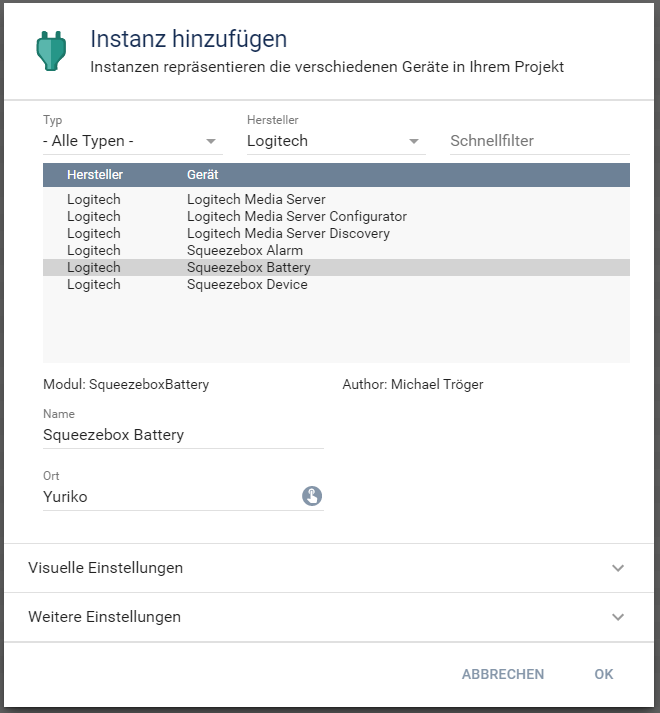
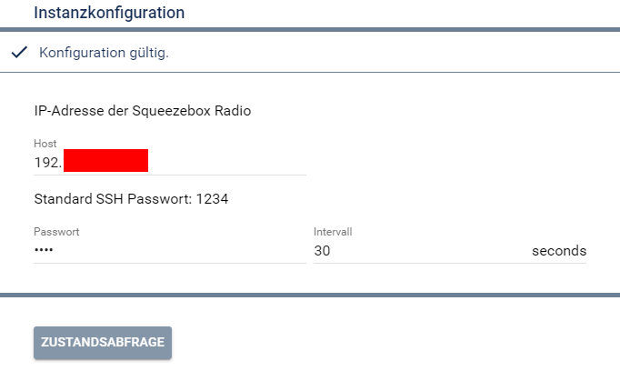
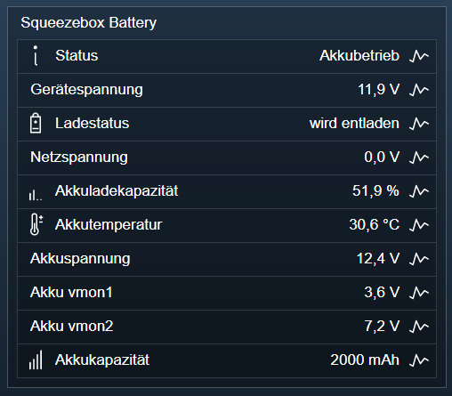
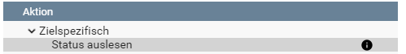

[](https://www.symcon.de/service/dokumentation/entwicklerbereich/sdk-tools/sdk-php/)
[](https://community.symcon.de/t/modul-squeezebox-release/46937)
[](https://www.symcon.de/de/service/dokumentation/installation/migrationen/v80-v81-q3-2025/)  
[](https://creativecommons.org/licenses/by-nc-sa/4.0/)
[](https://github.com/Nall-chan/SqueezeBox/actions) [](https://github.com/Nall-chan/SqueezeBox/actions)  
[](#2-spenden)[](#2-spenden)  

# Squeezebox Battery  <!-- omit in toc -->

Daten zur Stromversorgung und des Akkus in IPS einbinden.  

## Inhaltsverzeichnis  <!-- omit in toc -->

- [1. Funktionsumfang](#1-funktionsumfang)
- [2. Voraussetzungen](#2-voraussetzungen)
- [3. Software-Installation](#3-software-installation)
- [4. Einrichten der Instanzen in IP-Symcon](#4-einrichten-der-instanzen-in-ip-symcon)
- [5. Statusvariablen](#5-statusvariablen)
- [6. Visualisierung](#6-visualisierung)
- [7. PHP-Befehlsreferenz](#7-php-befehlsreferenz)
- [8. Aktionen](#8-aktionen)
- [9. Anhang](#9-anhang)
  - [1. Changelog](#1-changelog)
  - [2. Spenden](#2-spenden)
- [10. Lizenz](#10-lizenz)

## 1. Funktionsumfang

- Auslesen und darstellen von Werten der Stromversorgung und des Akkumulators.  

## 2. Voraussetzungen

- Symcon ab Version 8.2
- kompatibler Player mit aktivierten SSH-Zugang  

## 3. Software-Installation

Dieses Modul ist Bestandteil der [SqueezeBox-Library](../README.md#3-software-installation).  

## 4. Einrichten der Instanzen in IP-Symcon

Eine einfache Einrichtung ist über den Konfigurator [Logitech Media Server Konfigurator](../LMSConfigurator/README.md) möglich.  
Bei der manuellen Einrichtung ist die Instanz im Dialog `Instanz hinzufügen` unter dem Hersteller `Logitech` zu finden.  
  

**Konfigurationsseite:**  

  

| Name      | Eigenschaft |   Typ   | Standardwert | Funktion                             |
| :-------- | :---------- | :-----: | :----------- | :----------------------------------- |
| Host      | Address     | string  |              | IP-Adresse / Hostname der Squeezebox |
| Passwort  | Password    | string  | 1234         | Passwort für den SSH-Zugang          |
| Intervall | Interval    | integer | 30           | Abfrageintervall                     |

## 5. Statusvariablen

Folgende Statusvariablen werden automatisch angelegt.

**Statusvariablen:**  

| Name               |   Typ   | Ident              | Beschreibung                     |
| :----------------- | :-----: | :----------------- | :------------------------------- |
| Status             | integer | State              | Status der Stromversorgung       |
| Gerätespannung     |  float  | SysVoltage         | Interne Gerätespannung           |
| Netzspannung       |  float  | WallVoltage        | Spannung vom externen Anschluss  |
| Ladestatus         | integer | ChargeState        | Aktueller Betriebsmodus des Akku |
| Akkuladekapazität  |  float  | BatteryLevel       | in Prozent                       |
| Akkutemperatur     |  float  | BatteryTemperature | in °C                            |
| Akkuspannung Summe |  float  | BatteryVoltage     | in Volt                          |
| Akkuspannung 1     |  float  | BatteryVMon1       | in Volt                          |
| Akkuspannung 2     |  float  | BatteryVMon2       | in Volt                          |
| Akkukapazität      | integer | BatteryCapacity    | in mAh                           |

## 6. Visualisierung

Die direkte Darstellung der Instanz in der Kachel Visualisierung:  
  

Die direkte Darstellung der Instanz im WebFront:  
  

## 7. PHP-Befehlsreferenz

```php
bool LSQB_RequestState(int $InstanzID)
```

Aktuellen Status aus dem Gerät auslesen.  
Es wird `true` zurückgeben wenn die Abfrage erfolgreich war,  
oder `false` im Fehlerfall.  

## 8. Aktionen

Wenn eine 'Squeezebox Battery' Instanz als Ziel einer [`Aktion`](https://www.symcon.de/service/dokumentation/konzepte/automationen/ablaufplaene/aktionen/) ausgewählt wurde, steht folgende Aktion zur Verfügung:  

  

- Status aus dem Gerät auslesen

## 9. Anhang

### 1. Changelog

[Changelog der Library](../README.md#3-changelog)

### 2. Spenden

Die Library ist für die nicht kommerzielle Nutzung kostenlos, Schenkungen als Unterstützung für den Autor werden hier akzeptiert:  

PayPal:  
[](https://paypal.me/Nall4chan)  

Wunschliste:  
[](https://www.amazon.de/hz/wishlist/ls/YU4AI9AQT9F?ref_=wl_share)  

## 10. Lizenz

IPS-Modul:  
[CC BY-NC-SA 4.0](https://creativecommons.org/licenses/by-nc-sa/4.0/)  

phpseclib from Jim Wigginton <terrafrost@php.net>  
[MIT License](http://www.opensource.org/licenses/mit-license.html)  
Link: [http://phpseclib.sourceforge.net](http://phpseclib.sourceforge.net)  
